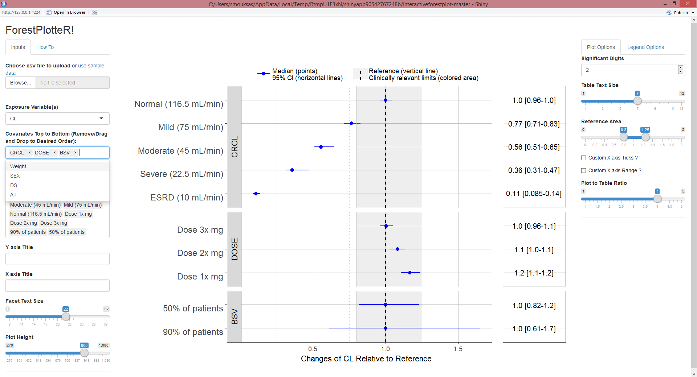

# interactiveforestplot
A Shiny App that Produce Forest Plots to Visualize Covariate Effects


### Running Information
Make sure to have all required packages installed code to install pacakges from CRAN and or github is below:

```
install.packages(c("dplyr","tidyr","ggplot2","ggstance","shiny","shinyjs","markdown","devtools"))
devtools::install_github("baptiste/egg")
shiny::runGitHub('interactiveforestplot', 'smouksassi')
```
### Example
An example data is provided.
Your data should have the following column names:
label,mid,lower,upper,covname,paramname
More on this soon

