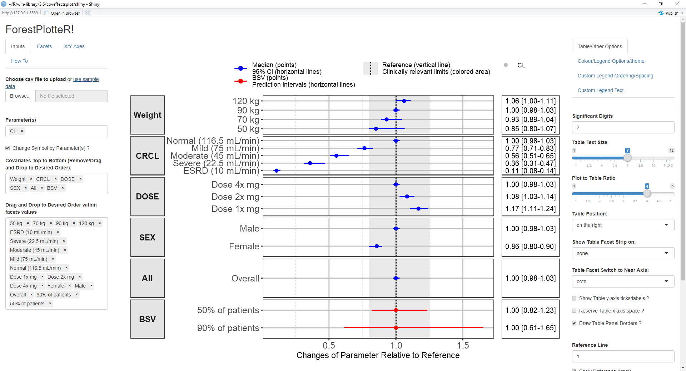

# coveffectsplot
A function and a Shiny App that Produce Forest Plots to Visualize Covariate Effects as commonly used in pharmacometrics population PK/PD reports.


### Running Information
Make sure to have all required packages installed code to install pacakges from CRAN and or github is below:

```
install.packages("devtools")
devtools::install_github('smouksassi/coveffectsplot')
coveffectsplot::run_interactiveforestplot()
```
### Example
Several example data are provided. if you want to bring your own data it should have at a minimum the following columns with the exact names:

paramname: Parameter on which the effects are shown e.g. CL, Cmax, AUC etc.

covname: Covariate name that the effects belong to e.g. Weight, SEX, Dose etc.

label: Covariate value that the effects of which is shown e.g. 50 kg, 50 kg\90 kg (here the reference value is contained in the label)

mid: Middle value for the effects usually the median from the uncertainty distribution

lower: Lower value for the effects usually the 2.5% or 5% from the uncertainty distribution

upper: Upper value for the effects usually the 97.5% or 95% from the uncertainty distribution

You might choose to have a covname with value All to illustrate and show the uncertainty on the reference value in a separate facet. Additionally you might choose to have a covname with value BSV to illustrate and show the effects of the between subject variability (BSV). The example data show where does 90 and 50% of the patients will be given the model BSV estimate for the shown paramname.

When you load the app and press the button to load the example data you get:



