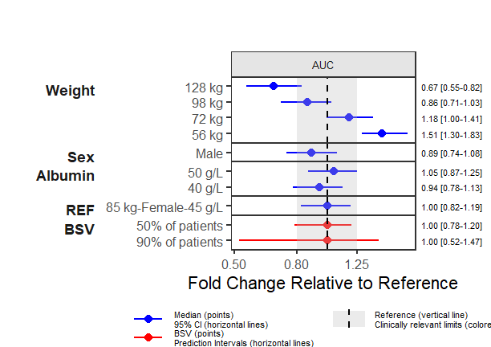
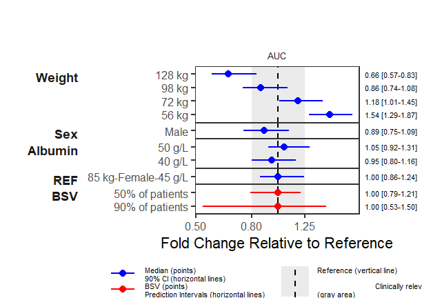
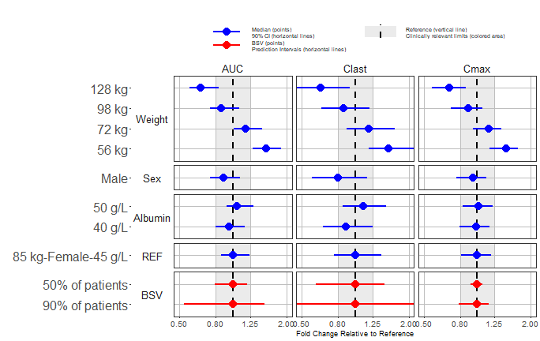
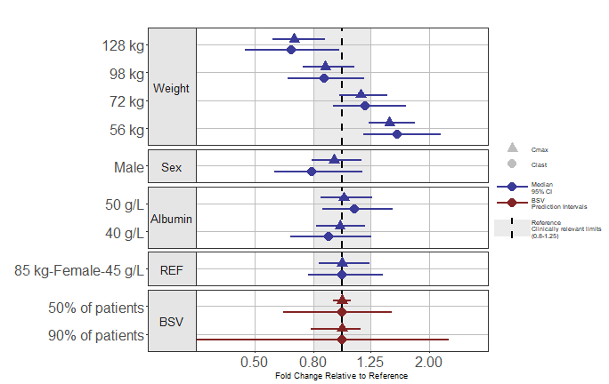

```{r, include = FALSE}
knitr::opts_chunk$set(
  collapse = TRUE,
  warning =FALSE,
  message =FALSE,
  comment = "#>",
  dev.args = list(png = list(type = "cairo"))
)
library(coveffectsplot)
library(mrgsolve)
library(ggplot2)
library(ggstance)
library(ggridges)
library(tidyr)
library(dplyr)
library(table1)
library(patchwork)
library(egg)
library(data.table)
theme_set(theme_bw())
#utility function to simulate varying one covariate at a time keeping the rest at the reference
expand.modelframe <- function(..., rv, covcol="covname") {
  args <- list(...)
  df <- lapply(args, function(x) x[[1]])
  df[names(rv)] <- rv
  res <- lapply(seq_along(rv), function(i) {
    df[[covcol]] <- names(rv)[i]
    df[[names(rv)[i]]] <- args[[names(rv)[i]]]
    as.data.frame(df)
  })
  do.call(rbind, res)
}
nbsvsubjects <- 1000
nsim <- 100 # uncertainty replicates for vignette you might want a higher number

round_pad <- function(x, digits = 2, round5up = TRUE) {
  eps <- if (round5up) x * (10^(-(digits + 3))) else 0
  formatC(round(x + eps, digits), digits = digits, format = "f", flag = "0")
}
```
Here we illustrate the approach with a two-compartment PK model defined with an ordinary differential equation (ODE) and covariates on the PK parameters Clearance (CL) and Volume (V). Weight, Albumin and Sex had effects on CL while Weight and Sex had effects on V. For simplicity no covariates had effects on peripheral clearance or volume. The approach is general and simulation based and can be easily extended to any ODE model with multiple covariate effects.

## Specifying a PK Model using `mrgsolve`

```{r pkmodel, collapse=TRUE }
codepkmodelcov <- '
$PARAM @annotated
KA    : 0.5   : Absorption rate constant Ka (1/h)
CL    : 4     : Clearance CL (L/h)
V     : 10    : Central volume Vc (L)
Vp    : 50    : Peripheral volume Vp (L)
Qp    : 10    : Intercompartmental clearance Q (L/h)
CLALB : -0.8  : Ablumin on CL (ref. 45 g/L)
CLSEX : 0.2   : Sex on CL (ref. Female)
CLWT  : 1     : Weight on CL (ref. 85 kg)
VSEX  : 0.07  : Sex on Vc (ref. Female)
VWT   : 1     : Weight on Vc (ref. 85 kg)

$PARAM @annotated // reference values for covariate
WT    : 85    : Weight (kg)
SEX   : 0     : Sex (0=Female, 1=Male)
ALB   : 45    : Albumin (g/L)

$PKMODEL cmt="GUT CENT PER", depot=TRUE, trans=11

$MAIN
double CLi = CL *
    pow((ALB/45.0), CLALB)*
    (SEX == 1.0 ? (1.0+CLSEX) : 1.0)*
    pow((WT/85.0), CLWT)*exp(nCL); 
double V2i = V *
    (SEX == 1.0 ? (1.0+VSEX) : 1.0)*
    pow((WT/85.0), VWT)*exp(nVC);  

double KAi = KA;
double V3i = Vp *pow((WT/85.0),    1);
double Qi = Qp *pow((WT/85.0), 0.75);

$OMEGA @annotated @block
nCL : 0.09       : ETA on CL
nVC : 0.01 0.09  : ETA on Vc

$TABLE
double CP   = CENT/V2i;

$CAPTURE CP KAi CLi V2i V3i Qi WT SEX ALB
'
modcovsim <- mcode("codepkmodelcov", codepkmodelcov)

partab <- setDT(modcovsim@annot$data)[block=="PARAM", .(name, descr, unit)]
partab <- merge(partab, melt(setDT(modcovsim@param@data), meas=patterns("*"), var="name"))
knitr::kable(partab)
```

### Simulate a Reference Subjects with BSV
We simulate the reference subject having the reference covariate values defined in the model which are:  
Weight = 85 kg, Sex = Female and Albumin = 45 g/L.
We also keep the between subject variability (BSV) to illustrate its effects on the concentration-time profiles on linear and log linear scales.

```{r pksimulation, fig.width=7, message=FALSE }
idata <- data.table(ID=1:nbsvsubjects, WT=85, SEX=0, ALB=45)

ev1 <- ev(time = 0, amt = 100, cmt = 1)
data.dose <- ev(ev1)
data.dose <- setDT(as.data.frame(data.dose))
data.all <- data.table(idata, data.dose)

outputsim <- modcovsim %>%
  data_set(data.all) %>%
  mrgsim(end = 24, delta = 0.25) %>%
  as.data.frame %>%
  as.data.table

outputsim$SEX <- factor(outputsim$SEX, labels="Female")

# Only plot a random sample of N=500
set.seed(678549)
plotdata <- outputsim[ID %in% sample(unique(ID), 500)]

p1 <- ggplot(plotdata, aes(time, CP, group = ID)) +
  geom_line(alpha = 0.2, size = 0.1) +
  facet_grid(ALB ~ WT + SEX, labeller = label_both) +
  labs(y = "Plasma Concentrations", x = "Time (h)")

p2 <- ggplot(plotdata, aes(time, CP, group = ID)) +
  geom_line(alpha = 0.2, size = 0.1) +
  facet_grid(ALB ~ WT + SEX, labeller = label_both) +
  scale_y_log10() +
  labs(y = expression(Log[10]~Plasma~Concentrations), x = "Time (h)")

p1+p2
```

### Compute PK Parameters, Plot and Summarize BSV
In this section we compute the PK parameters of interest, provide a plot of the parameters as well as of the standardized ones. We also summarize and report the BSV as ranges of 50 and 90% of patients for each PK parameter.

```{r computenca , fig.width=7 , message=FALSE }
derive.exposure <- function(time, CP) {
  n <- length(time)
  x <- c(
    Cmax = max(CP),
    Clast = CP[n],
    AUC = sum(diff(time) * (CP[-1] + CP[-n])) / 2
  )
  data.table(paramname=names(x), paramvalue=x)
}
refbsv <- outputsim[, derive.exposure(time, CP), by=.(ID, WT, SEX, ALB)]

p3 <- ggplot(refbsv, aes(
        x      = paramvalue,
        y      = paramname,
        fill   = factor(..quantile..),
        height = ..ndensity..)) +
  facet_wrap(~ paramname, scales="free", ncol=1) +
  stat_density_ridges(
    geom="density_ridges_gradient", calc_ecdf=TRUE,
    quantile_lines=TRUE, rel_min_height=0.001, scale=0.9,
    quantiles=c(0.05, 0.25, 0.5, 0.75, 0.95)) +
  scale_fill_manual(
    name   = "Probability",
    values = c("white", "#FF000050", "#FF0000A0", "#FF0000A0", "#FF000050", "white"),
    labels = c("(0, 0.05]", "(0.05, 0.25]",
               "(0.25, 0.5]", "(0.5, 0.75]",
               "(0.75, 0.95]", "(0.95, 1]")) +
  theme_bw() +
  theme(
    legend.position = "none",
    axis.text.y     = element_blank(),
    axis.ticks.y    = element_blank(),
    axis.title.y    = element_blank()) +
  labs(x="PK Parameters", y="") +
  scale_x_log10() +
  coord_cartesian(expand=FALSE)

# Obtain the standardized parameter value by dividing by the median.
refbsv[, stdparamvalue := paramvalue/median(paramvalue), by=paramname]

p4 <- ggplot(refbsv, aes(
        x      = stdparamvalue,
        y      = paramname,
        fill   = factor(..quantile..),
        height = ..ndensity..)) +
  facet_wrap(~ paramname, scales="free_y", ncol=1) +
  stat_density_ridges(
    geom="density_ridges_gradient", calc_ecdf=TRUE,
    quantile_lines=TRUE, rel_min_height=0.001, scale=0.9,
    quantiles=c(0.05, 0.25, 0.5, 0.75, 0.95)) +
  scale_fill_manual(
    name="Probability",
    values=c("white", "#FF000050", "#FF0000A0", "#FF0000A0", "#FF000050", "white"),
    labels = c("(0, 0.05]", "(0.05, 0.25]",
             "(0.25, 0.5]", "(0.5, 0.75]",
             "(0.75, 0.95]", "(0.95, 1]")) +
  theme_bw() +
  theme(
    legend.position = "none",
    axis.text.y     = element_blank(),
    axis.ticks.y    = element_blank(),
    axis.title.y    = element_blank()) +
  labs(x="Standardized PK Parameters", y="") +
  scale_x_log10() +
  coord_cartesian(expand=FALSE)

p3+p4
```

```{r, fig.width=7 ,message=FALSE, include=FALSE}
# p2<- p2 + theme_bw(base_size=18)
# 
# p3<- p3+theme_bw(base_size=18) +
#   theme(
#     axis.title.x =element_text(size=12),
#     legend.position = "none",
#     strip.background = element_blank(),
#     strip.text = element_blank(),
#     plot.margin = margin(0,0,0,0))+
#   xlab("Reference Subject\nPK Parameters with BSV")
# p4 <- p4+theme_bw(base_size=18) +
#   theme(
#         axis.title.x =element_text(size=12),
#        axis.text.y     = element_blank(),
#     axis.ticks.y    = element_blank(),
#     legend.position = "none",
#     strip.background = element_blank(),
#     strip.text = element_blank(),
#     panel.spacing = unit(10,"mm"),
#     plot.margin = margin(0,0,0,0))+
#   xlab("Reference Subject\nStandardized PK Parameters")
# (p2 + p3 +p4)
# 
# ggsave("Figure_4_1.png", device="png",type="cairo-png",
#        dpi=125, width =9 ,height=4)

```

**Ranges of BSV for each PK Parameter:**
```{r computebsvpk , fig.width=7 , message=FALSE }
bsvranges <- refbsv[,list(
    P05 = quantile(stdparamvalue, 0.05),
    P25 = quantile(stdparamvalue, 0.25),
    P50 = quantile(stdparamvalue, 0.5),
    P75 = quantile(stdparamvalue, 0.75),
    P95 = quantile(stdparamvalue, 0.95)), by = paramname]
bsvranges
```

## Generate and Simulate at Combinations of Covariate of Interest
Based on our observed covariate data, we compute percentiles of interest that we will use to simulate data at. Common practice is to compute the 5,25,75,95 percentiles (the median being the reference). In some cases, we might want to explore the min, max or other extreme case scenarios. Care should be taken as this approach might generate unrealistic combination of covariates that can never appear in a real patient. The utility function expand.modelframe (written by Benjamin Rich) is defined in the setup section of the vignette and can be found in the source code. It facilitates the creation of a set of covariate values varying one at a time. 

**Dataframe Holding Combinations of Covariates:**
```{r covcomb , fig.width=7 }
reference.values <- data.frame(WT = 85, ALB = 45, SEX = 0)   

covcomb <- expand.modelframe(
  WT  = c(56, 72, 98, 128), # P05, P25, P50, P75, P95
  ALB = c(40, 50),          # P05, P50, P95
  SEX = c(1),               # Reference is for SEX=0 (female)
  rv = reference.values)

# Add the reference
covcomb <- rbind(covcomb, data.table(reference.values, covname="REF"))

covcomb$ID <- 1:nrow(covcomb)

covcomb
```

### Simulation at Unique Combinations of Covariates
As a first step, we simulate without uncertainty and without BSV using `zero_re()` at unique combination of covariates and provide a plot to visualize the effects.  

```{r, fig.width=7 ,message=FALSE}
idata <- copy(covcomb)
idata <- idata [, covname := NULL]
ev1 <- ev(time=0, amt=100, cmt=1)
data.dose <- as.data.frame(ev1)
data.all <- data.table(idata, data.dose)

outcovcomb<- modcovsim %>%
  data_set(data.all) %>%
  zero_re() %>% 
  mrgsim(end=24, delta=0.25) %>%
  as.data.frame %>%
  as.data.table

outcovcomb$SEX <- factor(outcovcomb$SEX, labels=c("Female", "Male"))

ggplot(outcovcomb, aes(x=time, y=CP, col=factor(WT), linetype=SEX)) +
  geom_line(aes(group=ID), alpha=1, size=1.5) +
  facet_grid(ALB ~ WT, labeller=label_both) +
  labs(
    x        = "Time (h)",
    y        = "Plasma Concentrations",
    linetype = "Sex",
    colour   = "Weight",
    caption  = "Simulation without Uncertainty\nwithout BSV") +
  coord_cartesian(ylim=c(0,3.5))
```

### Adding Uncertainty from a Varcov Matrix
* First, we will invent a varcov matrix by assuming 15% relative standard errors and correlations of 0.2 across the board. We then simulate a 100 set of parameters using a multivariate normal (kept at 100 for the vignette, use more replicates for a real project). Also, unless the model was written in a way to allow unconstrained parameter values, care should be taken to make sure the simulated parameters are valid and make sense. When available, use the set of parameters from a bootstrap run.  

**Variance Covariance Matrix of fixed effects:**
```{r, fig.width=7}
theta <- unclass(as.list(param(modcovsim)))
theta[c("WT", "SEX", "ALB")] <- NULL
theta <- unlist(theta)
as.data.frame(t(theta))

cor2cov <- function (cor, sd) 
{
    if (missing(sd)) {
        sd <- diag(cor)
    }
    diag(cor) <- 1
    n <- nrow(cor)
    diag(sd, n) %*% cor %*% diag(sd, n)
}

varcov <- cor2cov(
  matrix(0.2, nrow=length(theta), ncol=length(theta)),
  sd=theta*0.15)
rownames(varcov) <- colnames(varcov) <- names(theta)
as.data.frame(varcov)
```

### Generating Sets of Parameters with Uncertainty
* Second, we generate the sim_parameters dataset using `mvrnorm` and then incorporate the uncertainty by simulating using a different set of parameters (row) for each replicate.  

**First Few Rows of a Dataset Containing Simulated Fixed Effects with Uncertainty:**
```{r, fig.width=7}
set.seed(678549)
# mvtnorm::rmvnorm is another option that can be explored
sim_parameters <- MASS::mvrnorm(nsim, theta, varcov, empirical=T) %>% as.data.table
head(sim_parameters)
```

### Iterative Simulation to Apply the Uncertainty
* Third, we illustrate how you can iterate over a set of parameters value using a `for` loop. We then overlay the previous simulation results without uncertainty on the one with uncertainty to visualize the effect of adding it.

```{r, fig.width=7,fig.height=4}
idata <- copy(covcomb)
idata <- idata [, covname := NULL]
ev1       <- ev(time=0, amt=100, cmt=1)
data.dose <- as.data.frame(ev1)
iter_sims <- NULL
for(i in 1:nsim) {
  data.all  <- data.table(idata, data.dose, sim_parameters[i])
  out <- modcovsim %>%
    data_set(data.all) %>%
    zero_re() %>% 
    mrgsim(start=0, end=24, delta=0.25) %>%
    as.data.frame %>%
    as.data.table
  out[, rep := i]
  iter_sims <- rbind(iter_sims, out)
}
iter_sims$SEX <- factor(iter_sims$SEX, labels = c("Female", "Male"))

pkprofileuncertainty<- ggplot(iter_sims, aes(x=time, y=CP, col=factor(WT), linetype=SEX)) +
  geom_line(aes(group=interaction(ID, rep)), alpha=0.1, size=0.1) +
  geom_line(data = outcovcomb, aes(group=interaction(ID)),
            alpha= 1, size=0.7, colour = "black") +
  facet_grid(ALB ~ WT, labeller=label_both) +
  labs(
    x        = "Time (h)",
    y        = "Plasma Concentrations",
    linetype = "No Uncertainty\nSex",
    colour   = "Uncertainty\nReplicates\nWeight",
    caption  = "Simulation with Uncertainty\nwithout BSV") +
  coord_cartesian(ylim=c(0,3.5))+
  guides(colour = guide_legend(override.aes = list(alpha = 1)))
pkprofileuncertainty
```

### Compute PK Parameters and Boxplots   
Similar to an earlier section, we compute the PK parameters by patient and by replicate standardize by the computed median for reference subject and provide a plot. We add some data manipulation to construct more informative labels that will help in the plotting.

```{r, fig.width=7, include=FALSE, message=FALSE}
out.df.univariatecov.nca <- iter_sims[, derive.exposure(time, CP), by=.(rep, ID, WT, SEX, ALB)]
out.df.univariatecov.nca

refvalues <- out.df.univariatecov.nca[
  ALB==45 & WT==85 & SEX=="Female",
  .(medparam = median(paramvalue)), by=paramname]
refvalues
```

**Median Parameter Values for the Reference:**
```{r, fig.width=7,fig.height=5 ,message=FALSE}
covcomb[covname=="WT",  covvalue := paste(WT,"kg")]
covcomb[covname=="ALB", covvalue := paste(ALB,"g/L")]
covcomb[covname=="SEX", covvalue := "Male"]
covcomb[covname=="REF", covvalue := "85 kg Female 45 g/L"]
covcomb
covcomb[covname=="REF", covvalue := "85 kg\nFemale\n45 g/L"]

out.df.univariatecov.nca <- merge(
  out.df.univariatecov.nca,
  covcomb[, .(ID, covname, covvalue)])

setkey(out.df.univariatecov.nca, paramname)

out.df.univariatecov.nca <- merge(
  out.df.univariatecov.nca,
  refvalues)

out.df.univariatecov.nca[, paramvaluestd := paramvalue/medparam]

boxplotdat <- out.df.univariatecov.nca[covname!="REF"]
boxplotdat[covname=="WT",  covname2 := "Weight"]
boxplotdat[covname=="ALB", covname2 := "Albumin"]
boxplotdat[covname=="SEX", covname2 := "Sex"]

boxplotdatREFWT <- out.df.univariatecov.nca[covname=="REF"]
boxplotdatREFWT[, covname2 := "Weight"]
boxplotdatREFWT[, covvalue := covcomb[covname=="REF", covvalue]]

boxplotdatREFSEX <- out.df.univariatecov.nca[covname=="REF"]
boxplotdatREFSEX[, covname2 := "Sex"]
boxplotdatREFSEX[, covvalue := covcomb[covname=="REF", covvalue]]

boxplotdatREFALB <- out.df.univariatecov.nca[covname=="REF"]
boxplotdatREFALB[, covname2 := "Albumin"]
boxplotdatREFALB[, covvalue := covcomb[covname=="REF", covvalue]]

boxplotdat <- rbind(
  boxplotdat,
  boxplotdatREFWT,
  boxplotdatREFSEX,
  boxplotdatREFALB)

boxplotdat[paramname=="AUC",   paramname2 := "AUC"]
boxplotdat[paramname=="Clast", paramname2 := "C[last]"]
boxplotdat[paramname=="Cmax",  paramname2 := "C[max]"]

boxplotdat[, covname2 := factor(covname2, levels=unique(covname2))]
#boxplotdat[, covvalue := factor(covvalue, levels=unique(covvalue))]
boxplotdat[, covvalue := factor(covvalue,
  levels=c("56 kg", "72 kg", "40 g/L", "Male", "85 kg\nFemale\n45 g/L", "98 kg", "128 kg", "50 g/L"))]

pkparametersboxplot<- ggplot(boxplotdat, aes(x=covvalue, y=paramvalue))+
  facet_grid(paramname2 ~ covname2, scales="free", labeller=label_parsed,
             switch="both") +
  geom_boxplot() +
  labs(y="Parameter Values") +
  theme(axis.title=element_blank(),
        strip.placement = "outside")
pkparametersboxplot
```

```{r, fig.width=7 ,message=FALSE, include=FALSE}
# pkprofileuncertainty <- pkprofileuncertainty +theme_bw(base_size = 13)+
#   theme(axis.title.y = element_text(size=15))+
#   guides(colour=guide_legend(override.aes = list(alpha=1,size=0.5)),
#          linetype=guide_legend(override.aes = list(size=0.5)))+
#   coord_cartesian(ylim=c(0,4))
# pkprofileuncertainty
# ggsave("Figure_4_3.png", device="png",type="cairo-png",width= 7, height = 4,dpi=72)
# 
# pkparametersboxplot
# ggsave("Figure_4_4.png", device="png",type="cairo-png",width= 7, height = 4,dpi=72)
# 
# png("Figure_4_34.png", type="cairo-png",width= 2*7*72, height =5*72)
# egg::ggarrange(pkprofileuncertainty,pkparametersboxplot,nrow=1)
# dev.off()
```

### Alternative View of the Data: Distributions and Intervals 
Here we provide an alternative visual summary of the standardized PK parameters. It shows the distribution, quantiles of interest. It isolates each covariate effects in one panel keeping the reference on its own. It is exactly the same data as the boxplots. Which visual presentation do you prefer? Which one enables you to clearly see and compare the covariate effects?  

```{r, fig.width=7, fig.height=4 ,message=FALSE}
out.df.univariatecov.nca[covname=="WT",      covname2 := "Weight"]
out.df.univariatecov.nca[covname=="ALB",     covname2 := "Albumin"]
out.df.univariatecov.nca[covname=="SEX",     covname2 := "Sex"]
out.df.univariatecov.nca[covname=="REF",     covname2 := "Reference"]
out.df.univariatecov.nca[paramname=="AUC",   paramname2 := "AUC"]
out.df.univariatecov.nca[paramname=="Clast", paramname2 := "C[last]"]
out.df.univariatecov.nca[paramname=="Cmax",  paramname2 := "C[max]"]

out.df.univariatecov.nca[, covvalue   := factor(covvalue, levels=unique(covvalue))]
out.df.univariatecov.nca[, covname2   := factor(covname2, levels=unique(covname2))]
out.df.univariatecov.nca[, paramname2 := factor(paramname2, levels=unique(paramname2))]

ggplot(out.df.univariatecov.nca, aes(
    x      = paramvaluestd,
    y      = covvalue,
    fill   = factor(..quantile..),
    height = ..ndensity..)) +
  facet_grid(covname2 ~ paramname2,
    scales   = "free_y",
    space    = "free",
    labeller = label_parsed)+
  annotate("rect",
    xmin  = 0.8,
    xmax  = 1.25,
    ymin  = -Inf,
    ymax  = Inf,
    fill  = "gray",
    alpha = 0.4) +
  stat_density_ridges(
    geom           = "density_ridges_gradient",
    calc_ecdf      = TRUE,
    quantile_lines = TRUE,
    rel_min_height = 0.001,
    scale          = 0.9,
    quantiles      = c(0.05,0.5, 0.95)) +
  scale_x_continuous(
    breaks = c(0.25, 0.5, 0.8, 1/0.8, 1/0.5, 1/0.25),
    tran   = "log") +
  scale_fill_manual(
    name   = "Probability",
    values = c("white", "#0000FFA0", "#0000FFA0", "white"),
    labels = c("(0, 0.05]", "(0.05, 0.5]","(0.5, 0.95]", "(0.95, 1]")) +
  geom_vline(aes(xintercept=1), size=1) +
  theme_bw() +
  labs(x="Effects Relative to Parameter Reference Value", y="")+
  scale_x_continuous(breaks=c(0.25,0.5,0.8,1/0.8,1/0.5,1/0.25),trans ="log" )
```

```{r, fig.width=7 ,message=FALSE, include=FALSE}
 #  last_plot()+theme(legend.position="none")
 # ggsave("Figure_4_5.png", device="png",type="cairo-png",
 #        width= 7, height = 4,dpi=72)
```


### Adding the BSV and Using `forest_plot`
To contrast the covariate effects with random unexplained variability we add to the data the BSV intervals computed in an earlier section. We then do some data manipulation and formatting to produce a plot from the package function `forest_plot`. To simplify we will only keep AUC before revisiting more than one parameter plots at the end. 

```{r, fig.width=7, fig.height=6}
fpdata <- out.df.univariatecov.nca[,
  setNames(as.list(quantile(paramvaluestd, probs=c(0.5, 0.05, 0.95))), c("mid", "lower", "upper")),
  by=.(paramname2, covname2, covvalue)]

bsvranges[paramname=="AUC",   paramname2 := "AUC"]
bsvranges[paramname=="Clast", paramname2 := "C[last]"]
bsvranges[paramname=="Cmax",  paramname2 := "C[max]"]
setkey(bsvranges, paramname2)

fpdataBSV50 <- fpdata[covname2 == "Reference"]
fpdataBSV50$covname2 <- "BSV"
fpdataBSV50$covvalue <- "50% of patients"
setkey(fpdataBSV50, paramname2)

fpdataBSV50$lower    <- bsvranges[,"P25"]
fpdataBSV50$upper    <- bsvranges[,"P75"]

fpdataBSV90 <- fpdata[covname2 == "Reference"]
fpdataBSV90$covname2 <- "BSV"
fpdataBSV90$covvalue <- "90% of patients"
setkey(fpdataBSV90, paramname2)

fpdataBSV90$lower    <- bsvranges[,"P05"]
fpdataBSV90$upper    <- bsvranges[,"P95"]

fpdata <- rbind(fpdata, fpdataBSV90, fpdataBSV50)

fpdata[, LABEL := sprintf("%s [%s, %s]",
  round_pad(mid, 2),
  round_pad(lower, 2),
  round_pad(upper, 2)) ]

setnames(fpdata, "paramname2", "paramname")
setnames(fpdata, "covname2", "covname")
setnames(fpdata, "covvalue", "label")

fpdata[, label := factor(label, levels=unique(label))]

interval_legend_text <- "Median (points)\n90% CI (horizontal lines)"
interval_bsv_text    <- "BSV (points)\nPrediction Intervals (horizontal lines)"
ref_legend_text      <- "Reference (vertical line)\nClinically relevant limits\n(gray area)"
area_legend_text     <- "Reference (vertical line)\nClinically relevant limits\n(gray area)"

png("./Figure4_6.png",width =9 ,height = 6,units = "in",res=72)
coveffectsplot::forest_plot(fpdata[paramname=="AUC"],
                            ref_area               = c(0.8, 1/0.8),
                            x_range                = c(0.5, 2),
                            strip_placement        = "inside",
                            base_size              = 18,
                            y_label_text_size      = 12,
                            xlabel                 = "Fold Change Relative to Reference",
                            ref_legend_text        = ref_legend_text,
                            area_legend_text       = area_legend_text,
                            interval_legend_text   = interval_legend_text,
                            interval_bsv_text      = interval_bsv_text,
                            facet_formula          = "covname ~ paramname",
                            facet_switch           = "y",
                            facet_scales           = "free_y",
                            facet_space            = "free",
                            paramname_shape        = FALSE,
                            table_position         = "right",
                            table_text_size        = 4,
                            plot_table_ratio       = 3,
                            show_table_facet_strip = "none",
                            logxscale              = TRUE,
                            major_x_ticks          = c(0.5, 0.8, 1/0.8, 1/0.5),
                            return_list            = FALSE)
dev.off()
```


## Customization of the Plots
In this section, we first show a `forest_plot` built-in theme, then how you to get the ggplots as a list for further editing using ggplot code.

### Using `theme_benrich` along Additional Options
This is achieved by setting `theme_benrich = TRUE`, specifying that you want no legend
`legend_position = "none"`. With this theme active you can also control the `table_title` text and `table_title_size` arguments.

```{r,message=FALSE,fig.width=7}
png("./coveffectsplot4.png",width =9 ,height = 6,units = "in",res=72)
coveffectsplot::forest_plot(fpdata[paramname=="AUC"],
                            ref_area = c(0.8, 1/0.8),
                            x_range = c(0.5,2),
                            xlabel = "Fold Change Relative to Reference",
                            x_label_text_size= 10,
                            facet_formula = "covname~paramname",
                            theme_benrich = TRUE,
                            table_title_size = 15,
                            table_title = "Median [90% CI]",
                            interval_legend_text = interval_legend_text,
                            interval_bsv_text = interval_bsv_text,
                            legend_position = "none",
                            strip_placement = "outside",
                            base_size = 12,
                            facet_switch = "y",
                            facet_scales = "free_y",
                            facet_space = "free",
                            paramname_shape = FALSE,
                            table_position = "right",
                            table_text_size=4,
                            plot_table_ratio = 3,
                            show_table_facet_strip = "none",
                            logxscale = TRUE,
                            major_x_ticks =    c(0.25,0.5,0.8,1/0.8,1/0.5,1/0.25),
                            return_list = FALSE)
dev.off()
```


### Returning a List of ggplots
You can get the underlying ggplots as a list for further editing by setting `return_list = TRUE` and saving it into an object. The list will contain two objects the first being the main plot and the second the table. We illustrate how you can modify the look of the plots using regular ggplot code that modify the facet text color to `gray` and italic. Finally we recombine the plots using `egg::ggarrange`.

```{r,message=FALSE,fig.width=7}
png("./coveffectsplot0.png",width =9 ,height = 6,units = "in",res=72)

plotlists <- coveffectsplot::forest_plot(fpdata[paramname=="AUC"],
                            ref_area = c(0.8, 1/0.8),
                            xlabel = "Fold Change Relative to Reference",
                            ref_legend_text = "Reference (vertical line)\nClinically relevant limits\n(gray area)",
                            area_legend_text = "Reference (vertical line)\nClinically relevant limits\n(gray area)",
                            interval_legend_text = interval_legend_text,
                            interval_bsv_text = interval_bsv_text,
                            facet_formula = "covname~paramname",
                            facet_switch = "y",
                            facet_scales = "free_y",
                            facet_space = "free",
                            paramname_shape = FALSE,
                            table_position = "right",
                            table_text_size=4,
                            plot_table_ratio = 4,
                            show_table_facet_strip = "none",
                            logxscale = TRUE,
                            major_x_ticks = c(0.25,0.5,0.8,1/0.8,1/0.5,1/0.25),
                            return_list = TRUE)
plotlists
dev.off()
``` 


```{r, fig.width=7, fig.height=6, warning=FALSE,message=FALSE}
main_plot <- plotlists[[1]] + theme(
               panel.spacing=unit(10, "pt"),
               panel.grid=element_blank(),
               panel.grid.minor=element_blank(),
               legend.position="bottom",
               strip.placement.y="outside",
               strip.background.y=element_blank(),
               strip.text.y=element_text(
                   hjust=1,
                   vjust=1,
                   face="italic",color="gray",
                   size=rel(1)),
               legend.text = element_text(size=rel(0.5)),
               plot.margin = margin(t=0,r=0,b=0,l=5,unit="pt")) +
  scale_y_discrete(
breaks=c("90% of patients",
         "50% of patients",
         "85 kg\nFemale\n45 g/L",
         "40 g/L","50 g/L","Male",
         "56 kg","72 kg","98 kg","128 kg"
),
labels=c("90% of patients",
               "50% of patients",
               "85 kg-Female-45 g/L",
               "40 g/L","50 g/L","Male",
               "56 kg","72 kg","98 kg","128 kg"
)
  )

table_plot <- plotlists[[2]] + theme(
               panel.border=element_blank(),
               panel.spacing=unit(10, "pt"),
               strip.background.y=element_blank(),
               legend.text = element_text(size=rel(0.5)),
               plot.margin = margin(t=0,r=5,b=0,l=0,unit="pt"))

png("./coveffectsplot5.png",width =8.5 ,height = 6,units = "in",res=72)
egg::ggarrange(
  main_plot,
  table_plot,
  nrow = 1,
  widths = c(3, 1)
)
dev.off()
```



### Launch the Shiny App for Point and Click Editing
Alternatively, you can launch the app by typing `run_interactiveforestplot(yourdataname)` for point and click editing. This will help you in quickly generating the plot you want.
```{r ,echo=FALSE}
# uncomment in interactive mode
# run_interactiveforestplot(coveffectsdatacovrepbsv)
```
## Plots with Multiple PK Parameters
You can also have plots with more than one PK parameter. You may want to facet by parameter, or to use different shape by parameter.

### Facet by Parameter
This is achieved by setting `paramname_shape = FALSE` and `facet_formula = "covname~paramname"`. We also suppress the table by using `table_position = "none"` and reduce the plot text sizes using `base_size = 11`.

```{r, fig.width=7, fig.height=6,message=FALSE}
png("./coveffectsplot6.png",width =9.5 ,height = 6,units = "in",res=72)
forest_plot(fpdata,
                            ref_area = c(0.8, 1/0.8),
                            x_range = c(0.5,2),
                            xlabel = "Fold Change Relative to Reference",
                            facet_formula = "covname~paramname",
                            interval_legend_text = interval_legend_text,
                            interval_bsv_text = interval_bsv_text,
                            facet_switch = "y",
                            facet_scales = "free_y",
                            facet_space = "free",
                            facet_labeller = label_parsed,
                            paramname_shape = FALSE,
                            table_position = "none",
                            table_text_size=4,
                            base_size = 11,
                            plot_table_ratio = 4,
                            show_table_facet_strip = "none",
                            logxscale = TRUE,
                            major_x_ticks = c(0.5,0.8,1/0.8,1/0.5),
                            x_label_text_size = 10,
                            return_list = FALSE)
dev.off()
```




### Shape by Parameter
This is achieved by setting `paramname_shape = TRUE` we also illustrate how you can use `legend_order` to choose the legend ordering and few other options.

```{r, fig.width=7, fig.height=6,message=FALSE}
png("./coveffectsplot7.png",width =9.5 ,height = 6,units = "in",res=72)
forest_plot(fpdata[paramname!="AUC"],
                            ref_area = c(0.8, 1/0.8),
                            x_range = c(0.35,1/0.35),
                            xlabel = "Fold Change Relative to Reference",
            ref_legend_text = "Reference\nClinically relevant limits\n(0.8-1.25)",
            area_legend_text = "Reference\nClinically relevant limits\n(0.8-1.25)",
            interval_legend_text = "Median\n90% CI",
            interval_bsv_text = "BSV\nPrediction Intervals", 
                            facet_formula = "covname~.",
                            paramname_shape = TRUE,
            legend_order =c("shape","pointinterval","ref", "area"),
                            legend_shape_reverse = TRUE,
                            bsv_col = scales::muted("red"),
                            interval_col = scales::muted("blue"),
                            facet_switch = "y",
                            facet_scales = "free_y",
                            facet_space = "free",
                            table_position = "none",
                            table_text_size=4,
                            base_size = 9,
                            plot_table_ratio = 4,
                            show_table_facet_strip = "none",
                            logxscale = TRUE,
                            major_x_ticks = c(0.5,0.8,1/0.8,1/0.5),
                            legend_space_x_mult = 0.01,
                            legend_position = "right",
                            return_list = FALSE)
dev.off()
```



We leave it up to the reader to edit the plot above to `parse` the labels of the shape legend to get subscripts.  

While we covered varying one at a time covariate value (marginal effects), we can use observed or simulated distribution of correlated covariates and simulate joint covariate effects as illustrated in the PK Model in Pediatric Patients vignette.  
