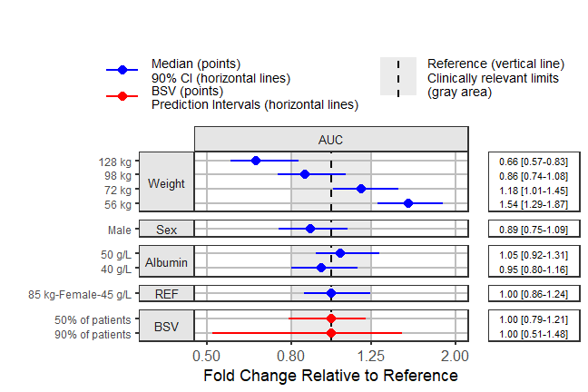

```{r, include = FALSE}
knitr::opts_chunk$set(
  collapse = TRUE,
  comment = "#>"
)
library(coveffectsplot)
library(mrgsolve)
library(ggplot2)
library(ggstance)
library(ggridges)
library(tidyr)
library(dplyr)
library(table1)
library(patchwork)
theme_set(theme_bw())
#utility function to simulate varying one covariate at a time keeping the rest at the reference
expand.modelframe <- function(..., rv, covcol="covname") {
  args <- list(...)
  df <- lapply(args, function(x) x[[1]])
  df[names(rv)] <- rv
  res <- lapply(seq_along(rv), function(i) {
    df[[covcol]] <- names(rv)[i]
    df[[names(rv)[i]]] <- args[[names(rv)[i]]]
    as.data.frame(df)
  })
  do.call(rbind, res)
}
```
## Specifying a PK Model using mrgsolve
Here we illustrate the approach with a two-compartment PK model defined with an ODE and covariates on Clearance and Volume 

```{r pkmodel, collapse=TRUE }
codepkmodelcov <- '
$PARAM
CL = 4, V=10 , KA=0.5, Vp =50, Qp= 10,
CLAGE = 0.15, CLALB = -0.8, CLSEX = 0.2, CLWT = 1,
VSEX   = 0.07, VWT = 1,
WT=85, SEX=0, AGE=45, ALB =45   

$CMT GUT CENT PER
$MAIN
double CLi = CL *
    pow((AGE/45.0), CLAGE)*
    pow((ALB/45.0), CLALB)*
    (SEX == 1.0 ? (1.0+CLSEX) : 1.0)*
    pow((WT/85.0), CLWT)*exp(ETA(1)); 
double Vi = V *
    (SEX == 1.0 ? (1.0+VSEX) : 1.0)*
    pow((WT/85.0), VWT)*exp(ETA(2));  

double KAi = KA;
double Vpi = Vp *pow((WT/70.0),    1);
double Qpi = Qp *pow((WT/70.0), 0.75);
double Keli = CLi/Vi    ;
double Kpti = Qpi/Vi    ;
double Ktpi = Qpi/Vpi   ;
$OMEGA
0.3 
0.01 0.3 

$ODE
dxdt_GUT  = -KAi*GUT;
dxdt_CENT =  KAi*GUT-Keli*CENT-Kpti*CENT+Ktpi*PER;
dxdt_PER  =                    Kpti*CENT-Ktpi*PER;

$TABLE
double CP   = CENT/ Vi;
double CPER =  PER/Vpi;
$CAPTURE CP CPER KAi CLi Vi Vpi Qpi 
'
modcovsim <- mcode("codepkmodelcov", codepkmodelcov)
```
### Simulate a thousand reference subject with BSV
We simulate with between subject variability (BSV) and provide a plot of concentrations on linear and log linear scales.

```{r pksimulation, fig.width=6 }
idata <- tibble(
  ID = 1:1000,
  WT = 85,
  AGE = 45,
  ALB = 45,
  SEX = 0
)
ev1 <- ev(time = 0, amt = 100, cmt = 1)
data.dose <- ev(ev1)
data.dose <- as.data.frame(data.dose)
data.all <- merge(idata, data.dose)

outputsim <- modcovsim %>%
  data_set(data.all) %>%
  carry.out(WT, AGE, SEX, ALB, CLi) %>%
  mrgsim(end = 24, delta = 0.25)
outputsim <- as.data.frame(outputsim)
outputsim <- outputsim %>%
  arrange(ID, time)
outputsim$SEX <- as.factor(outputsim$SEX)

set.seed(678549)
p1 <- ggplot(data = outputsim[outputsim$ID %in% sample(unique(outputsim$ID), 500), ],
       aes(time, CP, group = ID)) +
  geom_line(alpha = 0.2, size = 0.1) +
  facet_grid(ALB ~ WT+SEX,
             labeller = label_both) +
  labs(y = "Plasma Concentrations", color = "Sex", x = "Time (h)")
set.seed(678549)
p2 <- ggplot(data = outputsim[outputsim$ID %in% sample(unique(outputsim$ID), 500), ],
       aes(time, CP, group = ID)) +
  geom_line(alpha = 0.2, size = 0.1) +
  facet_grid(ALB ~ WT+SEX,
             labeller = label_both) +
  scale_y_log10() +
  labs(y = "Plasma Concentrations", color = "Sex", x = "Time (h)")
p1+p2
```

### Compute NCA PK parameters, Plot and Summarize BSV
We then compute simple NCA parameters, provide a plot of the parameters as well as of the standardised ones. We also summarize and report the BSV as ranges of 50 and 90% of patients for each NCA parameter.

```{r computenca , fig.width=6 , message=FALSE }
NCATYPICAL <- outputsim %>%
  group_by(ID, ALB, WT, SEX) %>%
  summarise (
    Cmax = max(CP, na.rm = TRUE),
    Clast = CP[n()],
    AUC = sum(diff(time) * na.omit(lead(CP) + CP)) / 2
  ) %>%
  gather(paramname, paramvalue, Cmax, Clast, AUC)

p3 <- ggplot(NCATYPICAL,
       aes(x=paramvalue,y=paramname,fill=factor(..quantile..),height=..ndensity..))+
    facet_wrap(~paramname,scales="free",ncol=1)+
  stat_density_ridges(
    geom = "density_ridges_gradient", calc_ecdf = TRUE,
    quantile_lines = TRUE, rel_min_height = 0.001,scale=0.9,
    quantiles = c(0.05,0.25,0.5,0.75, 0.95)) +
  scale_fill_manual(
    name = "Probability", values = c("#FF0000A0","#0000FFA0", "white","white", "#0000FFA0","#FF0000A0"),
    labels = c("(0, 0.05]", "(0.05, 0.25]",
               "(0.25, 0.5]","(0.5, 0.75]",
               "(0.75, 0.95]","(0.95, 1]")
  )+
  theme_bw()+
  scale_x_log10()+
  coord_cartesian(expand = FALSE)


NCATYPICALREF <- NCATYPICAL%>%
  group_by (paramname) %>%
  mutate(medparam = median(paramvalue),
         paramvalue = paramvalue / medparam) 

p4 <- ggplot(NCATYPICALREF,
       aes(x=paramvalue,y=paramname,fill=factor(..quantile..),height=..ndensity..))+
  stat_density_ridges(
    geom = "density_ridges_gradient", calc_ecdf = TRUE,
    quantile_lines = TRUE, rel_min_height = 0.001,scale=0.9,
    quantiles = c(0.05,0.25,0.5,0.75, 0.95)) +
  scale_fill_manual(
    name = "Probability", values = c("#FF0000A0","#0000FFA0", "white","white", "#0000FFA0","#FF0000A0"),
    labels = c("(0, 0.05]", "(0.05, 0.25]",
               "(0.25, 0.5]","(0.5, 0.75]",
               "(0.75, 0.95]","(0.95, 1]")
  )+
  theme_bw()+
  labs(x="Standardized NCA parameters",y="")+
  scale_x_log10()+
  coord_cartesian(expand = FALSE)

p3+p4

  BSVRANGES<- NCATYPICALREF %>%
  summarize(
    P05 = quantile(paramvalue, 0.05),
    P25 = quantile(paramvalue, 0.25),
    P50 = quantile(paramvalue, 0.5),
    P75 = quantile(paramvalue, 0.75),
    P95 = quantile(paramvalue, 0.95)
  )
BSVRANGES
```

## Construct combination of covariate of interest
Based on our observed covariate data we compute percentiles that we will use to simulate data at. Common practice is to compute the 5,25,75,95 percentiles (the median being the reference). In some cases we might want to explore the min, max or extreme case scenarios. This approach might provide unrealistic combination of covriates that can nver appear in a real patient so care should be taken.

```{r covcomb , fig.width=6 }
reference.values <- data.frame(WT = 85, ALB = 45, SEX = 0 )   
covcomb <- expand.modelframe(
  WT  = c(56,72,85,98,128), #P05,P25,P50,P75,P95
  ALB = c(40,45,50),#P05,P50,P95
  SEX = c(0,1),#Refernce is for SEX =0
  rv = reference.values)
covcomb$ID <- 1:nrow(covcomb)
covcomb <- covcomb[!duplicated(
  paste(covcomb$WT,covcomb$AGE,covcomb$ALB,covcomb$SEX)),]
#remove duplicate cov combinations
covcomb
```

### Simulation at unique combination of covariates
For this first step we simulate without uncertainty and without BSV at unique combination of covariates generated above. We then plot the results to appreciate the effects.

```{r, fig.width=6 , include=FALSE}
codepkmodelcovcomb <- '
$PARAM
CL = 4, V=10 , KA=0.5, Vp =50, Qp= 10,
CLALB = -0.8, CLSEX = 0.2, CLWT = 1,
VSEX   = 0.07, VWT = 1,
WT=85, SEX=0, ALB =45   

$CMT GUT CENT PER
$MAIN
double CLi = CL *
    pow((ALB/45.0), CLALB)*
    (SEX == 1.0 ? (1.0+CLSEX) : 1.0)*
    pow((WT/85.0), CLWT);
double Vi = V *
    (SEX == 1.0 ? (1.0+VSEX) : 1.0)*
    pow((WT/85.0), VWT);

double KAi = KA;
double Vpi = Vp *pow((WT/70.0),    1);
double Qpi = Qp *pow((WT/70.0), 0.75);
double Keli = CLi/Vi    ;
double Kpti = Qpi/Vi    ;
double Ktpi = Qpi/Vpi   ;
$ODE
dxdt_GUT  = -KAi*GUT;
dxdt_CENT =  KAi*GUT-Keli*CENT-Kpti*CENT+Ktpi*PER;
dxdt_PER  =                    Kpti*CENT-Ktpi*PER;

$TABLE
double CP   = CENT/ Vi;
double CPER =  PER/Vpi;
$CAPTURE CP CPER KAi CLi Vi Vpi Qpi 
'
modcovcombsim <- mcode("codepkmodelcovcomb", codepkmodelcovcomb)
```

```{r, fig.width=6}
idata <- as.data.frame(covcomb)
ev1 <- ev(time=0,amt=100, cmt=1)
data.dose <- ev(ev1)
data.dose<-as.data.frame(data.dose)
data.all<-merge(idata,data.dose)
outcovcomb<- modcovcombsim %>%
  data_set(data.all) %>%
  carry.out(WT,AGE,SEX,ALB,CLi) %>%
  mrgsim(end=24, delta=1)
outcovcomb<-as.data.frame(outcovcomb)
outcovcomb <- outcovcomb %>% 
  arrange(ID,time,WT)
outcovcomb$SEX <- as.factor(outcovcomb$SEX )

ggplot(outcovcomb, aes(time,CP,col=factor(WT),linetype=factor(SEX)) )+
  geom_line(aes(group=interaction(ID)),alpha=0.6,size=2)+
  facet_grid(ALB~ WT,labeller = label_both)+
  labs(linetype="Sex",colour="Weight",caption ="Simulation without Uncertainty\nwithout BSV")+
  coord_cartesian(ylim=c(0,6))
```

## Adding Uncertainty from a varcov matrix
We will invent a varcov matrix by assuming 15% relative standard errors and 0.2 correlations across the board. We then simulate a 100 set of parameters using a multivariate normal (kept at 100 for the vignette, use more for a real project). Also, unless the model was written in a way to allow unconstrained parameter values, care should be taken to make sure the simulated parameters make sense or ,when available, use the set of parameters from a bootstrap run.

```{r, fig.width=6}
thmeans <- c(4,10,0.5,50,10,
             -0.8,0.2,1,
             0.07,1)
thvariances<- (c(4,10,0.5,50,10,-0.8,0.2,1,0.07,1)*0.15)^2
thecorrelations <- matrix(ncol=10,nrow=10)
diag(thecorrelations)<- 1
thecorrelations[lower.tri(thecorrelations, diag = FALSE)]<- 0.2
thecorrelations[upper.tri(thecorrelations, diag = FALSE)]<- 0.2
thevarcovmatrix<- diag(sqrt(thvariances))%*%thecorrelations%*%diag(sqrt(thvariances))
thevarcovmatrix
```

### Generating a set of parameters with uncertainty
Here we generate the sim_parameters dataset that we will plug in the uncertainty simulation by using a set of paramters (row) for each replicate.

```{r, fig.width=6}
nsim <- 100 # for vignette to make it run faster otherwise increase to 1000
sim_parameters <- MASS::mvrnorm(n = nsim, mu=as.numeric(thmeans),
                                Sigma=thevarcovmatrix, empirical = TRUE)
# library(mvtnorm) rmvnorm is another option that has an improved mvn

colnames(sim_parameters) <- colnames(thevarcovmatrix) <- c("CL","V","KA","Vp","Qp",
                                                           "CLALB","CLSEX","CLWT",
                                                           "VSEX","VWT")

sim_parameters<- as.data.frame(sim_parameters)
head(sim_parameters)
```

### Simulation at unique combination of covariates with uncertainty
Illustrating how you can iterate over a set of parameters value. Then we overlay the previous simulation witout uncertainty on the one with uncertainty.

```{r, fig.width=6}
iter_sims <- NULL
for(i in 1:nsim) {
  covcomb$covname<- NULL
  covcomb$ID <- 1:nrow(covcomb)
  idata <- as.data.frame(covcomb)
  ev1 <- ev(time=0,amt=100, cmt=1)
  data.dose <- ev(ev1)
  data.dose<-as.data.frame(data.dose)
  data.all<-merge(idata,data.dose)
  data.all$amt<- 100
  data.all$CL <- as.numeric(sim_parameters[i,1])
  data.all$V <- as.numeric(sim_parameters[i,2])
  data.all$KA <- as.numeric(sim_parameters[i,3])
  data.all$Vp <- as.numeric(sim_parameters[i,4])
  data.all$Qp <- as.numeric(sim_parameters[i,5])
  data.all$CLALB <- as.numeric(sim_parameters[i,6])
  data.all$CLSEX <- as.numeric(sim_parameters[i,7])
  data.all$CLWT <- as.numeric(sim_parameters[i,8])
  data.all$VSEX <- as.numeric(sim_parameters[i,9])
  data.all$VWT <- as.numeric(sim_parameters[i,10])
  
  out <- modcovcombsim %>%
    data_set(data.all) %>%
    carry.out(ALB,WT,SEX,amt) %>%
    mrgsim(start=0,end=24,delta=1) 
  dfsimunc <- as.data.frame(out%>% mutate(rep = i) )
  iter_sims <- rbind(iter_sims,dfsimunc)
}

ggplot(iter_sims, aes(time,CP,col=factor(WT),linetype=factor(SEX) ) )+
  geom_line(aes(group=interaction(ID,rep)),alpha=0.3,size=0.3)+
  geom_line(data=outcovcomb,aes(group=interaction(ID)),color="black")+
  facet_grid(ALB~ WT,labeller = label_both)+
  labs(linetype="Sex",colour="Weight",caption ="Simulation with Uncertainty\nwithout BSV")+
  coord_cartesian(ylim=c(0,6))

```

### Compute NCA PK parameters and boxplots   
Similar to the above we compute the NCA parameters, standardize by the median and provide a plot. Since the code is similar it is not shown refer to the source of the vignette to look at it. We should how to do some data manipulation that will help in the plotting.

```{r, fig.width=6, include=FALSE,message=FALSE}
out.df.univariatecov <- as.data.frame(iter_sims)
out.df.univariatecov <- out.df.univariatecov %>% 
  arrange(rep,ID,time)

out.df.univariatecov.nca <- out.df.univariatecov %>% 
  group_by(rep,ID,ALB,WT,SEX)%>% 
  summarise (Cmax = max(CP,na.rm = TRUE),
             Clast= CP[n()],
             AUC= sum(diff(time ) *na.omit(lead(CP) + CP)) / 2) 
out.df.univariatecov.nca <- out.df.univariatecov.nca %>% 
  arrange(rep,ID)

REFVALUES <- out.df.univariatecov.nca %>% 
  ungroup() %>% 
  filter(ALB==45, WT==85,SEX==0)%>%
  dplyr::summarize(refcmax= median(Cmax ),
                   refclast=median(Clast),
                   refauc =median(AUC))

out.df.univariatecov.nca$Cmax <- out.df.univariatecov.nca$Cmax/as.numeric(REFVALUES[1] )
out.df.univariatecov.nca$Clast <- out.df.univariatecov.nca$Clast/as.numeric(REFVALUES[2] )
out.df.univariatecov.nca$AUC <- out.df.univariatecov.nca$AUC/as.numeric(REFVALUES[3] )
```


```{r, fig.width=6}
out.df.univariatecov.nca <- out.df.univariatecov.nca %>% 
  ungroup() %>% 
  dplyr::mutate( covname = case_when(
    ID== 1 ~ "Weight",
    ID== 2 ~ "Weight",
    ID== 3 ~ "REF",
    ID== 4 ~ "Weight",
    ID== 5 ~ "Weight",
    ID== 6 ~ "Albumin",
    ID== 7 ~ "Albumin",
    ID== 8 ~ "Sex"
  ),
  covvalue =case_when(
    ID== 1 ~ paste(WT,"kg"), 
    ID== 2 ~ paste(WT,"kg"),
    ID== 3 ~ "85 kg-Female-45 g/L",
    ID== 4 ~ paste(WT,"kg"),
    ID== 5 ~ paste(WT,"kg"),
    ID== 6 ~ paste(ALB,"g/L"),
    ID== 7 ~ paste(ALB,"g/L"),
    ID== 8 ~ "Male"
  )
  )
out.df.univariatecov.nca.long <- gather(out.df.univariatecov.nca,
                                        paramname, paramvalue, Cmax:AUC)

out.df.univariatecov.nca.long$covname <-factor(as.factor(out.df.univariatecov.nca$covname ),
                          levels =  c("Weight","Sex","Albumin", "REF")
)

out.df.univariatecov.nca.long$covvalue <-factor(as.factor(out.df.univariatecov.nca$covvalue ),
                                               levels =  c("56 kg",
                                                           "72 kg",
                                                           "98 kg",
                                                           "128 kg",
                                                           "Male",
                                                           "40 g/L",
                                                           "50 g/L",
                                                           "85 kg-Female-45 g/L"
                                                           )
)

ggplot(out.df.univariatecov.nca.long,
       aes(paramname,paramvalue,col=factor(paramname),shape=factor(SEX) ))+
  geom_point(alpha=0.1,size=1)+
  geom_hline(yintercept = 1)+
  geom_boxplot()+
  facet_grid(ALB~ WT,labeller = label_both)+
  theme(axis.text.x=element_text(angle=30))+
  labs(y="PK Parameter Value",x="",shape="Sex",col="")


```

### A different view of the data with distributions and intervals 
Here we provide a visual summary of the PK parameters. It shows the distribution, quantiles of interest and a simpler median, 90% pointinterval summary right below it.
It is exactly the same data as the boxplots above but including AUC only. Which visual presentation do you prefer? Which one enables you to clearly see the covariate effects ?

```{r, fig.width=6,message=FALSE}
ggplot(out.df.univariatecov.nca.long[out.df.univariatecov.nca.long$paramname=="AUC",],
       aes(x=paramvalue,y=covvalue,fill=factor(..quantile..),height=..ndensity..))+
  facet_grid(covname~paramname,scales="free",space="free")+
  annotate( "rect",
            xmin = 0.8,
            xmax = 1.25,
            ymin = -Inf,
            ymax = Inf,
            fill = "gray",alpha=0.4
  )+
  stat_density_ridges(
    geom = "density_ridges_gradient", calc_ecdf = TRUE,
    quantile_lines = TRUE, rel_min_height = 0.001,scale=0.9,
    quantiles = c(0.05,0.5, 0.95)) +
  scale_fill_manual(
    name = "Probability", values = c("#FF0000A0", "white","white", "#0000FFA0"),
    labels = c("(0, 0.05]", "(0.05, 0.5]","(0.5, 0.95]", "(0.95, 1]")
  )+
  stat_summaryh(aes(x=paramvalue,y=covvalue),fun.data="median_hilow_h",
                color="steelblue",
                geom="pointrangeh",size=0.5,position=position_nudge(y=-0.1),
                fun.args = list(conf.int=0.9),inherit.aes = FALSE)+
  geom_vline( aes(xintercept = 1),size = 1)+
  theme_bw()+
  labs(x="Effects Relative to parameter reference value",y="")+
  scale_x_continuous(breaks=c(0.25,0.5,0.8,1/0.8,1/0.5,1/0.25))+
  scale_x_log10()
```

### Adding the BSV and using the forest_plot function
To contrast the covariate effects with random unexplained variability we add to the data the BSV intervals computed in an earlier section. We then do some data manipulation and formatting to produce a plot from the package function forest_plot. It can be overwhelming to understans what each argument does. For that reason we provide a shinyapp that will help you in setting all the options you might need.

```{r, fig.width=6, fig.height=6}
out.df.univariatecov.nca.long$covname<- as.character(out.df.univariatecov.nca.long$covname)
out.df.univariatecov.nca.long$covvalue<- as.character(out.df.univariatecov.nca.long$covvalue)

coveffectsdatacovrep <- out.df.univariatecov.nca.long %>% 
  dplyr::group_by(paramname,covname,covvalue) %>% 
  dplyr::summarize(
    mid= median(paramvalue),
    lower= quantile(paramvalue,0.05),
    upper = quantile(paramvalue,0.95))

coveffectsdatacovrepbsv <- coveffectsdatacovrep[coveffectsdatacovrep$covname=="REF",]
coveffectsdatacovrepbsv$covname <- "BSV"
coveffectsdatacovrepbsv$covvalue <- "50% of patients"
coveffectsdatacovrepbsv$label <-    "50% of patients"
coveffectsdatacovrepbsv$lower <- BSVRANGES$P25
coveffectsdatacovrepbsv$upper <- BSVRANGES$P75

coveffectsdatacovrepbsv2 <- coveffectsdatacovrep[coveffectsdatacovrep$covname=="REF",]
coveffectsdatacovrepbsv2$covname <- "BSV"
coveffectsdatacovrepbsv2$covvalue <- "90% of patients"
coveffectsdatacovrepbsv2$label <-    "90% of patients"
coveffectsdatacovrepbsv2$lower <- BSVRANGES$P05
coveffectsdatacovrepbsv2$upper <- BSVRANGES$P95
coveffectsdatacovrepbsv<- rbind(coveffectsdatacovrep,coveffectsdatacovrepbsv,coveffectsdatacovrepbsv2)
coveffectsdatacovrepbsv <- coveffectsdatacovrepbsv %>% 
  mutate(
    label= covvalue,
    LABEL = paste0(format(round(mid,2), nsmall = 2),
                   " [", format(round(lower,2), nsmall = 2), "-",
                   format(round(upper,2), nsmall = 2), "]"))
coveffectsdatacovrepbsv<- as.data.frame(coveffectsdatacovrepbsv)

coveffectsdatacovrepbsv$label <-factor(as.factor(coveffectsdatacovrepbsv$label ),
                                    levels =  c("56 kg",
                                                "72 kg",
                                                "98 kg",
                                                "128 kg",
                                                "Male",
                                                "40 g/L",
                                                "50 g/L",
                                                "85 kg-Female-45 g/L",
                                                "90% of patients",
                                                "50% of patients"
                                    )
)
coveffectsdatacovrepbsv$covname <-factor(as.factor(coveffectsdatacovrepbsv$covname ),
                                               levels =  c("Weight","Sex",
                                                           "Albumin", "REF", "BSV")
)
png("./coveffectsplot3.png",width =9 ,height = 6,units = "in",res=72)

coveffectsplot::forest_plot(coveffectsdatacovrepbsv[coveffectsdatacovrepbsv$paramname=="AUC",],
                            ref_area = c(0.8, 1/0.8),
                            x_range = c(0.5,2),
                            strip_placement = "inside",
                            base_size = 18,
                            y_label_text_size = 12,
                            xlabel = "Fold Change Relative to Reference",
                            ref_legend_text = "Reference (vertical line)\nClinically relevant limits\n(gray area)",
                            area_legend_text = "Reference (vertical line)\nClinically relevant limits\n(gray area)",
                            facet_formula = "covname~paramname",
                            facet_switch = "y",
                            facet_scales = "free_y",
                            facet_space = "free",
                            paramname_shape = FALSE,
                            table_position = "right",
                            table_text_size=4,
                            plot_table_ratio = 3,
                            show_table_facet_strip = "none",
                            logxscale = TRUE,
                            major_x_ticks = c(0.5,0.8,1/0.8,1/0.5),
                            return_list = FALSE)
dev.off()


```


## Customization of the plots
Here we illustrate how you can use a built-in theme and then how you can return the ggplots as a list so you can edit the plots using ggplot code.
Alternatively, you can save the data as a csv and launch the app for point and click edits.

### Using theme_benrich and other options to customize the look of the plots:
This is achieved by setting `theme_benrich = TRUE`

```{r,message=FALSE,fig.width=6}

png("./coveffectsplot4.png",width =9 ,height = 6,units = "in",res=72)
coveffectsplot::forest_plot(coveffectsdatacovrepbsv
                            [coveffectsdatacovrepbsv$paramname=="AUC",],
                            ref_area = c(0.8, 1/0.8),
                            x_range = c(0.5,2),
                            xlabel = "Fold Change Relative to Reference",
                            x_label_text_size= 10,
                            facet_formula = "covname~paramname",
                            theme_benrich = TRUE,
                            legend_position = "none",
                            strip_placement = "outside",
                            base_size = 12,
                            facet_switch = "y",
                            facet_scales = "free_y",
                            facet_space = "free",
                            paramname_shape = FALSE,
                            table_position = "right",
                            table_text_size=4,
                            plot_table_ratio = 3,
                            show_table_facet_strip = "none",
                            logxscale = TRUE,
                            major_x_ticks =    c(0.25,0.5,0.8,1/0.8,1/0.5,1/0.25),
                            return_list = FALSE)
dev.off()
```


### Returning a list of the plots for further editing:
This is achieved by setting `return_list = TRUE` and further editing of the plots using ggplot code.

```{r,message=FALSE,fig.width=6}
png("./coveffectsplot0.png",width =9 ,height = 6,units = "in",res=72)

plotlists <- coveffectsplot::forest_plot(coveffectsdatacovrepbsv
                                         [coveffectsdatacovrepbsv$paramname=="AUC",],
                            ref_area = c(0.8, 1/0.8),
                            xlabel = "Fold Change Relative to Reference",
                            ref_legend_text = "Reference (vertical line)\nClinically relevant limits\n(gray area)",
                            area_legend_text = "Reference (vertical line)\nClinically relevant limits\n(gray area)",
                            facet_formula = "covname~paramname",
                            facet_switch = "y",
                            facet_scales = "free_y",
                            facet_space = "free",
                            paramname_shape = FALSE,
                            table_position = "right",
                            table_text_size=4,
                            plot_table_ratio = 4,
                            show_table_facet_strip = "none",
                            logxscale = TRUE,
                            major_x_ticks = c(0.25,0.5,0.8,1/0.8,1/0.5,1/0.25),
                            return_list = TRUE)
plotlists
dev.off()

``` 


```{r, fig.width=6, fig.height=6, warning=FALSE,message=FALSE}
main_plot <- plotlists[[1]] + theme(
               panel.spacing=unit(0, "pt"),
               panel.grid=element_blank(),
               panel.grid.minor=element_blank(),
               legend.position="bottom",
               strip.placement.y="outside",
               strip.background.y=element_blank(),
               strip.text.y=element_text(
                   hjust=1,
                   vjust=1,
                   face="bold",
                   size=rel(1)),
               legend.text = element_text(size=rel(0.5)),
               plot.margin = margin(t=0,r=0,b=0,l=5,unit="pt"))

table_plot <- plotlists[[2]] + theme(
               panel.border=element_blank(),
               panel.spacing=unit(0, "pt"),
               strip.background.y=element_blank(),
               legend.text = element_text(size=rel(0.5)),
               plot.margin = margin(t=0,r=5,b=0,l=0,unit="pt"))

png("./coveffectsplot5.png",width =8.5 ,height = 6,units = "in",res=72)
egg::ggarrange(
  main_plot,
  table_plot,
  nrow = 1,
  widths = c(3, 1)
)
dev.off()

```


## Plots with more than one PK parameter
You can also have plots with more than one PK parameter shown.You may want to facet by parameter, or use different shape by parameter.

### Facet by parameter
This is achieved by setting `paramname_shape = FALSE` and `facet_formula = "covname~paramname"`

```{r, fig.width=6, fig.height=6,message=FALSE}
png("./coveffectsplot6.png",width =9.5 ,height = 6,units = "in",res=72)
forest_plot(coveffectsdatacovrepbsv,
                            ref_area = c(0.8, 1/0.8),
                            x_range = c(0.5,2),
                            xlabel = "Fold Change Relative to Reference",
                            facet_formula = "covname~paramname",
                            facet_switch = "y",
                            facet_scales = "free_y",
                            facet_space = "free",
                            paramname_shape = FALSE,
                            table_position = "none",
                            table_text_size=4,
                            base_size = 9,
                            plot_table_ratio = 4,
                            show_table_facet_strip = "none",
                            logxscale = TRUE,
                            major_x_ticks = c(0.5,0.8,1/0.8,1/0.5),
                            return_list = FALSE)
dev.off()
```


### Shape by parameter
This is achieved by setting `paramname_shape = TRUE`

```{r, fig.width=6, fig.height=6,message=FALSE}
png("./coveffectsplot7.png",width =9.5 ,height = 6,units = "in",res=72)
forest_plot(coveffectsdatacovrepbsv
                            [coveffectsdatacovrepbsv$paramname!="AUC",],
                            ref_area = c(0.8, 1/0.8),
                            x_range = c(0.35,1/0.35),
                            xlabel = "Fold Change Relative to Reference",
            ref_legend_text = "Reference\nClinically relevant limits\n(0.8-1.25)",
            area_legend_text = "Reference\nClinically relevant limits\n(0.8-1.25)",
            interval_legend_text = "Median\n95% CI",
            interval_bsv_text = "BSV\nPrediction Intervals", 
                            facet_formula = "covname~.",
                            paramname_shape = TRUE,
            legend_order =c("shape","pointinterval","ref", "area"),
                            legend_shape_reverse = TRUE,
                            bsv_col = scales::muted("red"),
                            interval_col = scales::muted("blue"),
                            facet_switch = "y",
                            facet_scales = "free_y",
                            facet_space = "free",
                            table_position = "none",
                            table_text_size=4,
                            base_size = 9,
                            plot_table_ratio = 4,
                            show_table_facet_strip = "none",
                            logxscale = TRUE,
                            major_x_ticks = c(0.5,0.8,1/0.8,1/0.5),
                            legend_space_x_mult = 0.01,
                            legend_position = "right",
                            return_list = FALSE)
dev.off()
```


