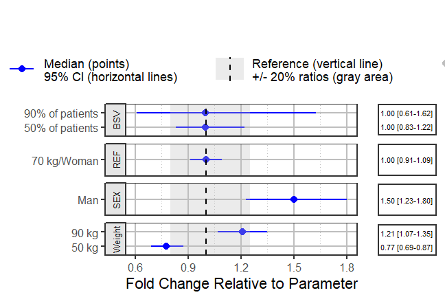

```{r setup, include = FALSE}
knitr::opts_chunk$set(
  collapse = TRUE,
  comment = "#>"
)
```

The use of forest plots to summarize the impact of various intrinsic and extrinsic factors on the pharmacokinetics (PK) of drugs is becoming a standard practice and a key part of submission packages to the FDA. The forest plots format make it easier for clinicians to quickly find and interpret the information they need.^[Essential pharmacokinetic information for drug dosage decisions: a concise visual presentation in the drug label. Clin Pharmacol Ther. 2011 Sep;90(3):471-4.]

## Motivation
Traditionally, a paragraph describing the various doses in various group is part of the official drug label and often a table is provided. The advantages of table versus graphs has been previously discussed and each has its own merits. An approach combining both would be ideal. While on a printed sheet of paper, we need to print the values of the data, web-based graphics would allow on-demand hovering effects, for example. However, for the moment, a drug label need to be presented on a printed static PDF. We argue that presenting a graphic as well as the associated values in a side table is very powerful.

## Background on a fictitious drug
Let us assume that we have a drug following a first-order absorption one-compartment PK model with parameters absorption constant (Ka), Clearance (CL) and Volume of distribution (V). Usually, a nonlinear mixed effects model is fitted to the PK data and covariates covering intrinsic and extrinsic are tested on the various parameters. For simplicity, let us assume that the covariate modeling did not add any covariate on Ka and V and provided the following model for CL:

$$CL = {POPCL} \times \left( \frac { \color{blue}{Weight}} {70}\right)^{dWTdCL}\times \left( dSEXdCL\times \left( \color{blue}{Sex}== 1  \right) \right)\times \left(  exp(\eta{CL})\right)$$

The above equation shows that we have two covariates on CL one is Weight (kg) a continuous variable with reference value of 70 (kg) and influencing CL with a power model with coefficient dWTdCL. The second is SEX which is an indicator variable taking the value of 0 (Woman, used as the reference category) and 1 (Man) influencing CL with a coefficient dSEXdCL. The last term denotes the individual deviations from the population (random effects) which assumes that CL in the population is log normally distributed. The same model can be more familiar to statisticians if re-written into a linear additive form:

$$log(CL) = {log(POPCL)} + dWTdCL\times log\left(\frac { \color{blue}{Weight}} {70}\right)+ \ log(dSEXdCL)\times\left(\color{blue}{Sex}== 1 \right)  +\eta{CL}$$
and where the individual level random effect desribes the between subject varibility (BSV) and is:
$$\eta{CL}\sim \mathcal{N}(0,\,\omega_{CL}^{2})$$
The modeling output would give you the value of the fixed effects parameters (POPCL, dWTdCL and dSEXdCL), the variance covariance matrix of the random effects as well as the associated uncertainty from the estimated asymptotic variance covariance matrix of the various estimated parameters. Alternatively, the uncertainty can also be obtained using a nonparametric bootstrap resampling of the individuals. Oftentimes, the uncertainty is reported as a standard error or relative standard error (%). If we are interested in reporting the standard error of CL in Men this would involve some error propagation using the delta method, using simulation from the variance covariance matrix or using the bootstrap distribution.

Of interest as well is the observed distribution of the covariates Weight and SEX in the studied population because to compute the effects we need to fill in a value for both. It is desirable to provide sensible values that would provide a good sense on where the bulk of the effects are. A good practice is to report the effects of the 75th percentile to the 25th percentile which will cover 50% of the population, some would also want to cover the 10th to the 90th percentiles. Alternatively, we might be interested to compute effects for clinically meaningful difference e.g. 20 kg so we report effects at 50, 70 and 90 kg.

Finally, since the BSV cannot be controlled for, showing the distribution of the BSV is important to contrast and compare with the estimated covariate related effects as this will allow us to understand where a random subject given a known set of covariate could possibly belong. Precomputing, some percentiles of the BSV distribution can even be more useful as estimating probabilities based on a plotted density estimate can be visually difficult. 

## Simulating data and modeling outputs

We will assume that the model fit had estimated parameters with relative standard errors of 5%. For this vignette, a simulation from a multivariate normal distribution with n= 10000 was used. The five first rows are shown in the table below. The assumed mean values for POPCL, dWTdCL and dSEXdCL were 10, 0.75 and 1.5 respectively.
For simplicity, we will also assume that there were equal number of SEX = 1 (Man) and SEX = 0 (Woman) and that men and women had mean weights of 75 and 65 kg and the same standard deviation of 15 kg (overall mean of 70 kg). 

```{r, echo=TRUE, results='asis',fig.align = "center",fig.width = 6}
set.seed(657687)
df <- data.frame(
MASS::mvrnorm(n = 10000,
                mu = c(10,0.75,1.5),
                Sigma=matrix(c((10*0.05)^2,
                               0.001,0.001,0.001,(0.75*0.05)^2,
                               0.001,0.001,0.001,(1.5*0.05)^2),3,3,byrow = TRUE) 
))
names(df) <- c("POPCL","dWTdCL","dSEXdCL")
knitr::kable(head(df,5))
```

```{r, echo=FALSE, results='asis',fig.align = "center",fig.width = 6}
dflong <- tidyr::gather(df)

ggplot2::ggplot(dflong,ggplot2::aes(x=value,fill=key))+
  ggplot2::geom_density(alpha=0.2)+
    ggplot2::facet_wrap(~key,scales="free",ncol=1)+
    ggplot2::labs(fill="",x="Uncertainty Distribution of the parameters")+
  ggplot2::theme(legend.position = "right",legend.background = 
                   ggplot2::element_rect(fill="transparent"))+
  ggplot2::guides(fill=ggplot2::guide_legend(reverse = TRUE))

dfcov<- data.frame(
MASS::mvrnorm(n=10000 ,
                mu =c(65,75),
                Sigma=matrix(c(15^2,0.01,0.01,15^2),2,2,byrow = TRUE) 
))
names(dfcov)<- c("WTWOMAN","WTMAN")
dfcovlong <- tidyr::gather(dfcov)
ggplot2::ggplot(dfcovlong,ggplot2::aes(x=value,fill=key))+
  ggplot2::geom_density(alpha=0.2)+
  ggplot2::labs(fill="",x="Weight (kg)")+
  ggplot2::theme(legend.position = "right",legend.background = 
                   ggplot2::element_rect(fill="transparent"))+
  ggplot2::guides(fill=ggplot2::guide_legend(reverse = TRUE))


dfcovlongquantile<- as.data.frame(
  quantile(dfcovlong$value,probs=c(0,0.05,0.25,0.5,0.75,0.95,1))
)
names(dfcovlongquantile)<- "Weightquantilevalue"
dfcovlongquantile$quantile<- rownames(dfcovlongquantile)


dfcovlongquantiletable<- t(dfcovlongquantile)
knitr::kable(dfcovlongquantiletable[1,,drop=FALSE],row.names=FALSE)
```

The model had the between subject variability on CL $\omega_{CL}^{2}$ variance assumed to be 0.09 which translate to apparent CV of sqrt (exp (0.09) -1) = 0.3069. A common way to report this BSV is to say we have 30.7% BSV. But what does this really mean in practical terms? If I take 50 patients (with the same covariate values) what are the chances that some of these patients will have very low or very high CL warranting dose changes? In other words, how much percent of the patients will have a CL less than or equal to half the CL of the reference value?
A  useful metric can be to compute the bounds where say 50% and 90% of the patients will be located using simple quantile functions on simulated distributions. For the 30.7% BSV case, we compute that 50% of the patients will be within the 0.82 to 1.23 interval (blue area) while 90% of the patients will be within the 0.61 to 1.63 interval (red area). A table showing the various quantiles is also shown.
```{r, echo=TRUE,fig.align = "center",fig.width = 6}
CLBSVdistribution <- data.frame(CL= 10*exp(rnorm(10000,0,sd=0.09^0.5)))
CLBSVdistribution$CLBSV<- CLBSVdistribution$CL/10
```

```{r, echo=FALSE,fig.align = "center",fig.width = 6}
dfbsv<- as.data.frame(
  quantile(CLBSVdistribution$CLBSV,probs=c(0,0.05,0.25,0.5,0.75,0.95,1)))
names(dfbsv)<- "BSVquantilevalue"
dfbsv$quantile<- rownames(dfbsv)
BSVLINE1<- data.frame(
                       mid = 1,
                       lower=quantile(CLBSVdistribution$CLBSV,c(0.05)),
                       upper=quantile(CLBSVdistribution$CLBSV,c(0.95)),
                       extent="BSV90%")

BSVLINE2<- data.frame( 
                       mid = 1,
                       lower=quantile(CLBSVdistribution$CLBSV,c(0.25)),
                       upper=quantile(CLBSVdistribution$CLBSV,c(0.75)),
                       extent="BSV50%")

BSVLINE <- rbind(BSVLINE1,BSVLINE2)
ggplot2::ggplot(data= CLBSVdistribution)+
 ggplot2:: geom_density(ggplot2::aes(x=CLBSV,
                   col="simomega")) +
   ggplot2::geom_rect(data=BSVLINE,
            ggplot2::aes(xmin=lower,xmax=upper  ,
                fill=extent),ymin=-Inf,ymax=Inf ,
           alpha=0.1)+
  ggplot2::geom_vline(xintercept=c(0.8,1,1.25))+
  ggplot2::theme_bw(base_size = 16)+
  ggplot2::theme(axis.text.y = ggplot2::element_blank(),
        axis.ticks.y = ggplot2::element_blank(),
        axis.text.x=ggplot2::element_text(size=12))+
  ggplot2::scale_x_continuous(breaks=c(0.25,0.5,0.8,1,1.25,1.5,2,3))+
  ggplot2::coord_cartesian(xlim=c(0.4,2))+
  ggplot2::labs(colour="",fill="BSV Coverage",x="BSVCL/Reference CL",
                title="Illustrating 30% BSV")+
  ggplot2::guides(fill = ggplot2::guide_legend(override.aes =  list(alpha = 0.1)  ))


dfbsvtable<- t(dfbsv)
knitr::kable(dfbsvtable[1,,drop=FALSE],row.names=FALSE)
```

## Visualizing effects distributions

We will divide POPCL by its median to standardize it. This will give a standardized value of 1 and its uncertainty when all covariates are held at the reference value(s) here SEX = 0 and Weight = 70 kg.
We will also compute the effects of Weight = 50 kg and 90 kg as compared to the 70 kg.
We keep dSEXdCL as is, it represents the effects of SEX = 1 effects when weight is held at its reference value = 70 kg. Additionally we can compute the effects for any combination of covariates e.g. Weight = 90 kg and SEX = 1. A clinical relevance areas e.g. between 0.8 and 1.25 of the reference value is shown since this is often regarded as the zone of PK equivalence. A covariate need to have lower or larger effects than this zone to trigger actions requiring dose changes. Finally we will make a plot that compare the magnitude of uncertainty, covariate distribution and between subject variability effects.

```{r,fig.width= 7}
dfeffects <- df
dfeffects$REF <- dfeffects$POPCL/ median(dfeffects$POPCL)
dfeffects$SEX_FEMALE_WT_50 <- dfeffects$REF*(50/70)^dfeffects$dWTdCL
dfeffects$SEX_FEMALE_WT_90 <-  dfeffects$REF*(90/70)^dfeffects$dWTdCL
dfeffects$SEX_Male_WT_70 <- dfeffects$dSEXdCL
dfeffects$SEX_Male_WT_90 <- dfeffects$dSEXdCL*dfeffects$REF*(90/70)^dfeffects$dWTdCL
dfeffects$BSV<-  CLBSVdistribution$CLBSV

dfeffects<- dfeffects[,c("SEX_FEMALE_WT_50",
                         "SEX_FEMALE_WT_90",
                         "SEX_Male_WT_70",
                         "SEX_Male_WT_90",
                         "REF",
                         "BSV")]


dflong <- tidyr::gather(dfeffects)
ggplot2::ggplot(dflong,ggplot2::aes(x=value,y=key,fill=factor(..quantile..)))+
ggridges::stat_density_ridges(
  geom = "density_ridges_gradient", calc_ecdf = TRUE,
  quantile_lines = TRUE, rel_min_height = 0.01,
  quantiles = c(0.025,0.5, 0.975)) +
  ggplot2::scale_fill_manual(
    name = "Probability", values = c("#FF0000A0", "white","white", "#0000FFA0"),
    labels = c("(0, 0.025]", "(0.025, 0.5]","(0.5, 0.975]", "(0.975, 1]")
  )+
      ggplot2::annotate(
        "rect",
        xmin = 0.8,
        xmax = 1.25,
        ymin = -Inf,
        ymax = Inf,
        fill = "gray",alpha=0.4
      )+
  ggplot2::geom_vline(
      ggplot2::aes(xintercept = 1),
      size = 1
    )+
  ggplot2::theme_bw()+
  ggplot2::labs(x="Effects Relative to parameter reference value",y="")
```
Next we overlay the various sources of variability to compare them head to head:
```{r,fig.width= 7}
ggplot2::ggplot(dfeffects)+
  ggplot2::geom_density(ggplot2::aes(x=REF,y=..scaled..,col="a.Uncertainty\nRSE=5%"))+
  ggplot2::geom_density(data=dfcovlong,
                        ggplot2::aes(x=(value/70)^0.75 ,
                                y=..scaled..,col="b.Weight\nMean=70 kg, sd=15 kg"))+
  ggplot2::geom_density(data=CLBSVdistribution ,ggplot2::aes(x=CLBSV,
                                     y=..scaled..,col="c.Between subject variability\nCV=30%"))+
  ggplot2::theme_bw(base_size = 16)+
  ggplot2::theme(axis.text.y = ggplot2::element_blank(),
        axis.ticks.y = ggplot2::element_blank())+
  ggplot2::scale_x_continuous(breaks=c(0.25,0.5,0.8,1,1.25,1.5,2,3))+
  ggplot2::coord_cartesian(xlim=c(0.25,2))+
  ggplot2::labs(color="",x="Effects Relative to parameter reference value",y= "Scaled Density")

```

## Simplifying the effects distributions data
The above plots might be overloading the reader with information. We will simplify it by removing unnecessary details and by computing the desired stats in advance.

```{r,}
dfeffects$SEX_Male_WT_90<- NULL
dfeffectslong<- tidyr::gather(dfeffects)
dfeffectslong<- dplyr::group_by(dfeffectslong,key)
dfeffectslongsummaries<- dplyr::summarise(dfeffectslong,mid=quantile(value,0.5),
                                   lower=quantile(value,0.025),
                                   upper=quantile(value,0.975))

dfeffectslongsummaries$paramname <- "CL"
dfeffectslongsummaries$covname <- c("BSV","REF","Weight","Weight","Sex")
dfeffectslongsummaries$label <- c("95% of patients","70 kg/Woman",
                                  "50 kg/Woman", "90 kg/Woman","70 kg/Man")
dfeffectslongsummaries<- rbind(dfeffectslongsummaries,
data.frame(key=c("BSV","BSV"),
           mid=c(quantile(dfeffects$BSV,0.5), quantile(dfeffects$BSV,0.5)),
           lower = c(quantile(dfeffects$BSV,0.25), quantile(dfeffects$BSV,0.05)),
            upper = c(quantile(dfeffects$BSV,0.75), quantile(dfeffects$BSV,0.95)),
           paramname= "CL",
           covname=c("BSV","BSV"),
           label = c("50% of patients","90% of patients")
)
)
dfeffectslongsummaries<- dfeffectslongsummaries[c(2,6,7,3,4,5),]

plotdata <- dplyr::mutate(dfeffectslongsummaries,
          LABEL = paste0(format(round(mid,2), nsmall = 2),
                         " [", format(round(lower,2), nsmall = 2), "-",
                         format(round(upper,2), nsmall = 2), "]"))
plotdata<- as.data.frame(plotdata)
plotdata<- plotdata[,c("paramname","covname","label","mid","lower","upper","LABEL")]
knitr::kable(plotdata)

```

## Plotting the Final Effects Data
First we do a simple plot. Then we call `coveffectsplot::forest_plot`to make the final plot with annotations, a side table with values, and legends. For interactive reordering and editing export the data as a "csv" and launch the shiny app via `coveffectsplot::run_interactiveforestplot()`

```{r,fig.width=7}
plotdata$covname <- as.factor(plotdata$covname)
plotdata$covname <- reorder(plotdata$covname , c(3,4,4,2,1,1))

plotdata$label <- reorder(as.factor(plotdata$label) , c(1,3,2,4,5,6))

ggplot2::ggplot(data = plotdata, ggplot2::aes_string(
      y = "label",
      x = "mid",
      xmin = "lower",
      xmax = "upper"
    )) +
    ggstance::geom_pointrangeh(
      position = ggstance::position_dodgev(height = 0.75),
      ggplot2::aes(color = "95 %CI\nCovariate Effects"),
      size = 1,
      alpha = 1
    )+
  ggplot2::facet_grid(covname~.,scales="free_y",switch="y")+
  ggplot2::labs(y="",x="Effects Relative to Reference Value",
                colour="")

png("coveffectsplot.png",width =9 ,height = 6,units = "in",res=72)
coveffectsplot::forest_plot(plotdata,
            ref_area = c(0.8, 1/0.8),
            x_facet_text_size = 13,
            y_facet_text_size = 13,
            ref_legend_text = "Reference (vertical line)\n+/- 20% ratios (gray area)",
            area_legend_text = "Reference (vertical line)\n+/- 20% ratios (gray area)",
            xlabel = "Fold Change Relative to Parameter",
            facet_formula = "covname~.",
            facet_switch = "both",
            facet_scales = "free",
            facet_space = "fixed",
            paramname_shape = TRUE,
            table_position = "right",
            table_text_size=4,
            plot_table_ratio = 4)
  dev.off()
  
```


