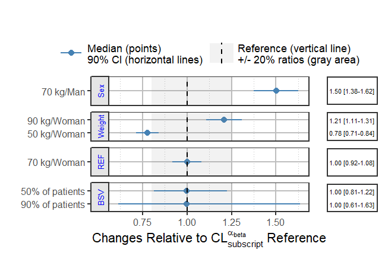

```{r setup, include = FALSE}
knitr::opts_chunk$set(
  dev = "png",
  collapse = TRUE,
  message =FALSE,
  warning =FALSE,
  fig.width = 7,
  comment = "#>"
)
if (capabilities(("cairo"))) {
  knitr::opts_chunk$set(dev.args = list(png = list(type = "cairo")))
}
library(coveffectsplot)
library(ggplot2)
library(ggridges)
library(tidyr)
suppressPackageStartupMessages( library(dplyr) )
nuncertainty <- 10000
nbsvsubjects <- 100000

```

The use of forest plots to summarize the impact of various intrinsic and extrinsic factors on the pharmacokinetics (PK) of drugs is becoming a standard practice and a key part of submission packages to the FDA. The forest plots format make it easier for clinicians to quickly find and interpret the information they need.^[Essential pharmacokinetic information for drug dosage decisions: a concise visual presentation in the drug label. Clin Pharmacol Ther. 2011 Sep;90(3):471-4.] Additional information can be found in the updated <a href="https://www.fda.gov/regulatory-information/search-fda-guidance-documents/population-pharmacokinetics">FDA Pop PK Guidance.</a>^[Population Pharmacokinetics Guidance for Industry February 2022.]

## Motivation
Traditionally, a paragraph describing the various doses in various group is part of the official drug label and often a table is provided. The advantages of table versus graphs has been previously discussed and each has its own merits. While web-based interactive graphics allow on-demand mouse hovering to show the graph numbers, this is not possible on a printed sheet of paper or on a static PDF as required for a drug label. As such, combining a graphic representation of the data with a side table provides the best of both worlds and provide to the clinician an efficient way to interpret the data.    
The `coveffectsplot` R  package aims to facilitate the creation of forest plots using the `forest_plot()`and `run_interactiveforestplot()` functions.

## Example 
Let us assume that we have a drug following a first-order absorption one-compartment PK model with parameters absorption constant (Ka), Clearance (CL) and Volume of distribution (V). Usually, a nonlinear mixed effects model is fitted to the PK data and covariates covering intrinsic and extrinsic are tested on the various parameters. For simplicity, let us assume that the covariate modeling did not add any covariate on Ka and V and provided the following model for CL:

$$CL = \color{blue}{POPCL} \times \left( \frac { \color{green}{Weight}} {70}\right)^\color{blue}{dWTdCL}\times \left(\color{blue} {dSexdCL}\times \left( \color{green}{Sex}== 1  \right) \right)\times exp(\color{red}\eta\color{red}{CL})$$

The above equation shows that we have two covariates on CL one is Weight (kg) a continuous variable with reference value of 70 (kg) and influencing CL with a power model with coefficient dWTdCL. The second is Sex which is an indicator variable taking the value of 0 (Woman, used as the reference category) and 1 (Man) influencing CL with a coefficient dSexdCL. The last term denotes the individual deviations from the population (random effects) which assumes that CL in the population is log normally distributed. The same model can be more familiar to statisticians if re-written into a log-linear additive form:

$$log(CL) = {log(\color{blue}{POPCL})} + \color{blue}{dWTdCL}\times log\left(\frac { \color{green}{Weight}} {70}\right)+ \ log(\color{blue}{dSexdCL})\times\left(\color{green}{Sex}== 1 \right) +\color{red}\eta\color{red}{CL} $$
and where the individual level random effect describes the between subject variability (BSV):
$$\eta{CL}\sim \mathcal{N}(0,\,\omega_{CL}^{2})$$

As mentioned in the FDA guidance there is two ways to conduct simulations:

1. Simulations Based on Uncertainty of Fixed-Effect Estimates:  
Where fixed effects and uncertainty are included without between subject variability.  
"For example, forest plots that illustrate the effect of covariates on the area under the concentration time curve (AUC) or other parameters can be generated based on simulations with uncertainty in fixed-effect parameters, thereby facilitating the interpretation of the relative importance of covariates on exposure. These types of simulations are also useful to evaluate the performance of new
dosing regimens for testing in future trials. Additionally, simulations with parameter uncertainty
can be used to graphically illustrate the effect of parameter precision on PK profiles."

2. Simulations Based on Estimates of Between-Subject Variability:  
"Between-subject variability in PK parameters is accounted for in simulations when the purpose is
to show the range of individual predictions of concentrations in the studied population. Residual
error is added to the individual prediction when the range of observed concentrations is the main
interest. If the purpose is to predict the observed concentration range of a future population, then
uncertainty in the between-subject variability should be accounted for in addition to the fixed effect parameters and residual error.
The correlation between random effects should be accounted for to avoid unrealistic parameter
combinations in subjects. Simulations that account for between-subject variability and include
covariate effects should be conducted in a population with realistic demographic variables.
Demographic variables can be obtained from databases or generated by resampling with
replacement of the individuals in the original study or by sampling the covariate distributions and
their correlations in the target population."


The pharmacometrician will need to decide what factors to include in the simulations of covariate effects depending on the goal of the simulation:

1. Fixed effects ? (POPCL, dWTdCL and dSexdCL from the model) and associated Uncertainty (from model varcov or bootstrap): Always
2. Covariate values or distributions ? (modeled data or a database):
    + Univariate &#8594; to determine relative importance
    + Realistic multivariate and correlated covariate distributions &#8594; to illustrate range of possible outcomes
3. Random effects ? (Omega matrix from the model) and associated Uncertainty (Inverse Wishart with degrees of freedom from n of subjects ): &#8594; to illustrate range of possible outcomes
4. Residual error and its Uncertainty ? (from model): &#8594; only when there is interest in the predicted concentrations distributions.


For the univariate covariate approach where we vary one covariate at a time keeping all the others at the reference values, a common practice is to report the effects of the 75th percentile to the 25th percentile which will cover 50% of the population. However most of the time we also want to cover 90% of the population (5th to the 95th percentiles) and then we end up showing  effects at the 5th, 25th, 50th, 75th and 95th percentiles. For some clinical covariates some cutoffs at specific values have clinical significance and they are used as is.

In many situations, the assumption of varying one covariate at a time does not hold and  we recommend to also conduct simulations with realistic distribution of correlated covariates. We provide several examples with both approaches in the various vignettes.

Since the BSV cannot be controlled for, showing the distribution of the BSV is important to contrast and compare with the estimated covariate related effects as this will allow us to understand where a random subject given a known set of covariates (e.g. at reference values) could possibly belong. We previously only showed the BSV effects at the reference values we now recommend to conduct two full simulations one without BSV and one with BSV to compare and contrast the results and understand the marginal univariate covariate effects
as well as the joint multivariate covariate effects with BSV to describe the range of possible outcomes in a population of subjects.

Both methods are complementary and needed in real-world applications.

## Simulating Data to Mimick Outputs from a Modeling Exercise

We will assume that the model fit had estimated parameters with relative standard errors of 15%. For this vignette, a simulation from a multivariate normal distribution with n= 10000 was used. The five first rows are shown in the table below. The assumed mean values for POPCL, dWTdCL and dSexdCL were 10, 0.75 and 1.5 respectively.
For simplicity, we will also assume that there were equal number of Sex = 1 (Man) and Sex = 0 (Woman) and that men and women had mean weights of 75 and 65 kg and the same standard deviation of 20 kg. Note that unless we explicitly code the simulation in a way to prevent negative weights (e.g. using a log normal distribution) we will end up simulating some negative ones.

```{r, echo=TRUE, results='asis',fig.align = "center",fig.width = 6}
set.seed(657687)
df <- data.frame(
MASS::mvrnorm(n = nuncertainty,
                mu = c(10,0.75,1.5),
                Sigma=matrix(c((10*0.15)^2,
                               0.001,0.001,0.001,(0.75*0.15)^2,
                               0.001,0.001,0.001,(1.5*0.15)^2),3,3,byrow = TRUE) 
))
names(df) <- c("POPCL","dWTdCL","dSexdCL")
knitr::kable(head(round(df,2),5))
```

```{r, echo=FALSE, results='asis',fig.align = "center",fig.width = 6}
dflong <- gather(df)

ggplot(dflong,aes(x=value))+
  geom_density(alpha=0.6, fill = "blue")+
    facet_wrap(~key,scales="free",ncol=1)+
    labs(fill="",x="Uncertainty Distribution (RSE 15%) of the Parameters")+
  theme(legend.position = "none",legend.background = 
                   element_rect(fill="transparent"),
                 axis.ticks.y = element_blank(),axis.text.y =element_blank())+
  guides(fill=guide_legend(reverse = FALSE))
set.seed(657687)
dfcov<- data.frame(
MASS::mvrnorm(n=nbsvsubjects,
                mu =c(65,75),
                Sigma=matrix(c(20^2,0.01,0.01,20^2),2,2,byrow = TRUE) 
))
names(dfcov)<- c("WTWOMAN","WTMAN")
dfcovlong <- gather(dfcov)
ggplot(dfcovlong,aes(x=value,linetype=key))+
  geom_density(alpha=0.2,fill="darkgreen",size=2)+
  labs(linetype="",x="Weight (kg)")+
  theme(legend.position = "right",legend.background = 
                   element_rect(fill="transparent"),axis.ticks.y = element_blank(),axis.text.y =element_blank())+
  guides(fill=guide_legend(reverse = FALSE))+
  theme_bw()


dfcovlongquantile<- as.data.frame(
  round(quantile(dfcovlong$value,probs=c(0.01,0.05,0.25,0.5,0.75,0.95,0.99)),0)
)
names(dfcovlongquantile)<- "Weightquantilevalue"
dfcovlongquantile$quantile<- rownames(dfcovlongquantile)

dfcovlongquantiletable<- t(dfcovlongquantile)
knitr::kable(dfcovlongquantiletable[1,,drop=FALSE],row.names=FALSE)
```

The model had a between subject variability on CL $\omega_{CL}^{2}$ variance of 0.09 which translates to apparent CV of sqrt (exp (0.09) -1) = 0.3069. A common way to report this BSV is to say we have 30.7% BSV. But what does this really mean in practical terms? What are the chances that a patient with known covariate values, will have very low or very high CL warranting dose changes?  
A useful metric can be to compute the bounds where say 50% and 90% of the patients will be located using simple quantile functions on simulated distributions. For the 30.7% BSV case, we compute that 50% of the patients will be within the 0.82 to 1.23 interval (dark red area) while 90% of the patients will be within the 0.61 to 1.63 interval (lighter red area). A table showing the various quantiles is also shown. For asymmetrical distribution we can also use the highest density intervals instead of percentiles but this is not shown here.

```{r, echo=TRUE,fig.align = "center",fig.width = 6}
set.seed(546789)
CLBSVdistribution <- data.frame(CL= 10*exp(rnorm(nbsvsubjects,0,sd=0.09^0.5)))
CLBSVdistribution$CLBSV<- CLBSVdistribution$CL/10
```

```{r, echo=FALSE,fig.align = "center",fig.width = 6 ,fig.height=4}
dfbsv<- as.data.frame(
  round( quantile(CLBSVdistribution$CLBSV,probs=c(0.01,0.05,0.25,0.5,0.75,0.95,0.99)),2))
names(dfbsv)<- "BSVquantilevalue"
dfbsv$quantile<- rownames(dfbsv)
CLBSVdistribution$paramname<- "CL"
bsvplot<-   ggplot(CLBSVdistribution, aes(
  x      = CLBSV,
  y      = paramname,
  fill   = factor(..quantile..),
  height = ..ndensity..)) +
  stat_density_ridges(
    geom="density_ridges_gradient", calc_ecdf=TRUE,
    quantile_lines=TRUE, rel_min_height=0.001, scale=0.9,
    quantiles=c(0.05, 0.25, 0.5, 0.75, 0.95)) +
  scale_fill_manual(
    name="BSV Ranges",
    values=c("white", "#FF000050", "#FF0000A0", "#FF0000A0", "#FF000050", "white"),
    labels = c("(0, 0.05]", "(0.05, 0.25]",
               "(0.25, 0.5]", "(0.5, 0.75]",
               "(0.75, 0.95]", "(0.95, 1]")) +
  theme_bw(base_size = 16) +
  theme(
    legend.position = "right",
    axis.text.y     = element_blank(),
    axis.ticks.y    = element_blank(),
    axis.title.y    = element_blank(),
    axis.text.x=element_text(size=12),
    axis.title.x=element_text(size=14)) +
  scale_x_continuous(breaks=c(0.61,0.82,1,1.22,1.63))+
  coord_cartesian(expand=FALSE,xlim = c(0.49,2.01))+
  labs(x="Standardized Individual Clearances with BSV",
                title="Illustrating 30.7% BSV")

bsvplot

dfbsvtable<- t(dfbsv)
knitr::kable(dfbsvtable[1,,drop=FALSE],row.names=FALSE)
#bayestestR::hdi(CLBSVdistribution$CLBSV,ci = c(.50, .90))
#0.55, 0.74, 1 , 1.12, 1.53
```

*Here we overlay the various sources of variability to compare them head to head:*
```{r,fig.width= 7}
dfeffects <- df
dfeffects$REFrange <- dfeffects$POPCL/ median(dfeffects$POPCL)

ggplot(dfeffects)+
  geom_density(aes(x=REFrange,y=..scaled..,col="a.Uncertainty\nRSE=15%"))+
  geom_density(data=dfcovlong,
                        aes(x=(value/70)^0.75 ,
                                y=..scaled..,col="b.Weight\nMean=70 kg, sd=20 kg"))+
  geom_density(data=CLBSVdistribution ,aes(x=CLBSV,y=..scaled..,
  col="c.Between subject variability\nCV=30.1%"))+
  theme_bw(base_size = 16)+
  theme(axis.text.y = element_blank(),
        axis.ticks.y = element_blank())+
  scale_x_continuous(breaks=c(0.25,0.5,0.8,1,1.25,1.5,2,3))+
  coord_cartesian(xlim=c(0.25,2))+
  labs(color="",x="Effects Standardized Relative\nto the Typical Value",y= "Scaled Density")+
  scale_color_manual(values=c("blue","green","red"))

```


## Visualizing Covariate Effects with Distributions

* First, we will divide the POPCL uncertainty distribution by its median to standardize it. This will make everything relative to the reference where all covariates are held at the reference value(s) here Sex = 0 and Weight = 70 kg.
* Second, We will compute the effects of Weight = 50 kg and 90 kg as compared to the 70 kg.
We keep dSexdCL as is, it represents the effects of Sex = 1 effects when weight is held at its reference value = 70 kg.
* Third, we optionally compute the effects for combination of covariates of interest e.g. Weight = 90 kg and Sex = 1. A clinical relevance areas e.g. between 0.8 and 1.25 of the reference value is shown since this is often regarded as the zone of PK equivalence. Usually, a covariate need to have effects driving PK exposures outside of this zone to trigger actions requiring dose changes.  
* Finally, we will make a plot that compare the magnitude of uncertainty, covariate distribution and between subject variability effects.

```{r,fig.width= 7}
dfeffects$REF <- 1
dfeffects$SEX_FEMALE_WT_50 <- (50/70)^dfeffects$dWTdCL
dfeffects$SEX_FEMALE_WT_90 <-  (90/70)^dfeffects$dWTdCL
dfeffects$SEX_Male_WT_70 <- dfeffects$dSexdCL
dfeffects$SEX_Male_WT_90 <- dfeffects$dSexdCL*(90/70)^dfeffects$dWTdCL
dfeffects$BSV_REF<-  sample(CLBSVdistribution$CLBSV, nuncertainty)

dfeffects<- dfeffects[,c("SEX_FEMALE_WT_50",
                         "SEX_FEMALE_WT_90",
                         "SEX_Male_WT_70",
                         "SEX_Male_WT_90",
                         "REF",
                         "BSV_REF")]


dflong <- tidyr::gather(dfeffects,key,value,-REF)
ggplot(dflong,aes(x=value,y=key,fill=factor(..quantile..)))+
ggridges::stat_density_ridges(
  geom = "density_ridges_gradient", calc_ecdf = TRUE,
  quantile_lines = TRUE, rel_min_height = 0.01,
  quantiles = c(0.05,0.5, 0.95)) +
  scale_fill_manual(
    name = "Probability", values = c("#FF0000A0", "white","white", "#0000FFA0"),
    labels = c("(0, 0.05]", "(0.05, 0.5]","(0.5, 0.95]", "(0.95, 1]")
  )+
      annotate(
        "rect",
        xmin = 0.8,
        xmax = 1.25,
        ymin = -Inf,
        ymax = Inf,
        fill = "gray",alpha=0.4
      )+
  geom_vline(
      aes(xintercept = 1),
      size = 1
    )+
  theme_bw()+
  labs(x="Effects Relative to parameter reference value",y="")
```


## Simplifying the Distributions into Ranges of Effects
The above plots might be overloading the reader with information. We will simplify it by removing unnecessary details and by computing the desired stats in advance.
The reference value is one by definition and at each simulation replicate the effects are relative to the reference of the replicate.

```{r,}
dfeffects$SEX_Male_WT_90<- NULL
dfeffects$REF <- 1
dfeffectslong<- gather(dfeffects)
dfeffectslong<- dplyr::group_by(dfeffectslong,key)
dfeffectslongsummaries<- dplyr::summarise(dfeffectslong,mid=quantile(value,0.5),
                                   lower=quantile(value,0.05),
                                   upper=quantile(value,0.95))

dfeffectslongsummaries$paramname <- "CL"
dfeffectslongsummaries$covname <- c("BSV","REF","Weight","Weight","Sex")
dfeffectslongsummaries$label <- c("95% of patients","70 kg/Woman",
                                  "50 kg/Woman", "90 kg/Woman","70 kg/Man")
dfeffectslongsummaries<- rbind(dfeffectslongsummaries,
data.frame(key=c("BSV","BSV"),
           mid=c(quantile(dfeffects$BSV,0.5), quantile(dfeffects$BSV,0.5)),
           lower = c(quantile(dfeffects$BSV,0.25), quantile(dfeffects$BSV,0.05)),
            upper = c(quantile(dfeffects$BSV,0.75), quantile(dfeffects$BSV,0.95)),
           paramname= "CL",
           covname=c("BSV","BSV"),
           label = c("50% of patients","90% of patients")
)
)
dfeffectslongsummaries<- dfeffectslongsummaries[c(2,6,7,3,4,5),]

plotdata <- dplyr::mutate(dfeffectslongsummaries,
          LABEL = paste0(format(round(mid,2), nsmall = 2),
                         " [", format(round(lower,2), nsmall = 2), "-",
                         format(round(upper,2), nsmall = 2), "]"))
plotdata<- as.data.frame(plotdata)
plotdata<- plotdata[,c("paramname","covname","label","mid","lower","upper","LABEL")]
knitr::kable(plotdata)

```

## Plotting the Effects Data
First we do a customized `ggplot` but we quickly notice that it has some issues like the lack of legend for the clinical reference area, vertical labels etc. We then show how using `coveffectsplot::forest_plot` can generate a plot annotations, a side table with values, and legends. For interactive reordering of categories, editing of labels and more, export the data as a "csv" and launch the shiny app via `coveffectsplot::run_interactiveforestplot()`.

```{r,fig.width=7 }
plotdata$covname <- as.factor(plotdata$covname)
plotdata$covname <- reorder(plotdata$covname , c(3,4,4,2,1,1))

plotdata$label <- reorder(as.factor(plotdata$label) , c(1,3,2,4,5,6))
  ggplot(data = plotdata[plotdata$covname!="REF",], aes_string(
      y = "label",
      x = "mid",
      xmin = "lower",
      xmax = "upper"
    )) +
      geom_pointrange(
      aes(color = "90 %CI\nCovariate Effects"),
      size = 1,
      alpha = 1
    )+
  annotate("rect", xmin = min(0.8), 
      xmax = max(1.25), ymin = -Inf, ymax = Inf, fill = "gray",alpha=0.1)+
  geom_vline(aes(xintercept = 1,linetype="Reference"))+ 
  facet_grid(covname~.,scales="free_y",switch="y")+
  labs(y="",x="Effects Relative to Reference Value",
                colour="",linetype="")+
  theme_bw()+
    scale_color_manual(values=c("blue"))
```

```{r,dpi = 72}
png("./coveffectsplot.png",width =9 ,height = 6,units = "in",res=72)
 coveffectsplot::forest_plot(plotdata[plotdata$covname!="REF",],
            ref_area = c(0.8, 1/0.8),
            x_facet_text_size = 13,
            y_facet_text_size = 13,
            interval_legend_text = "Median (points)\n90% CI (horizontal lines)",
            ref_legend_text = "Reference (vertical line)\n+/- 20% ratios (gray area)",
            area_legend_text = "Reference (vertical line)\n+/- 20% ratios (gray area)",
            xlabel = "Fold Change Relative to a 70kg Woman",
            facet_formula = "covname~.",
            facet_switch = "both",
            facet_scales = "free",
            facet_space = "fixed",
            paramname_shape = TRUE,
            show_table_facet_strip = "none",
            table_position = "right",
            table_text_size=4,
            plot_table_ratio = 4,
            legend_space_x_mult = 0.5,
            return_list = FALSE)
dev.off()
```

 
Using interactive graphics with hover on-demand functionality would remove the need for a side table, this can be achieved using `plotly`. The code is included but not evaluated to keep the size of the vignette small.
```{r,fig.width=7 ,eval=FALSE}

  plotdata<- plotdata[ c(3,2,1,4,5,6),]
  plotly::plot_ly(plotdata) %>%
  plotly::add_segments(
  x = ~ round(lower, 2),
  xend = ~ round(upper, 2),
  y = ~ label,
  yend = ~ label,
  name = '90%CI',
  line = list(color = plotly::toRGB("blue", alpha = 0.5), width = 5),
  hoverinfo = "text",
  text = ~ paste("</br> 90%CI: ",
  paste(round(lower, 2), round(upper, 2)))
  ) %>%
  plotly::add_markers(
  x = ~ round(mid, 2),
  y = ~ label,
  name = "Median",
  marker  = list(
  color = plotly::toRGB("black", alpha = 0.3),
  size = 20,
  symbol = "diamond"
  ),
  hoverinfo = "text",
  text = ~ paste("</br> Median: ",
  paste(round(mid, 2)))
  ) %>%
  plotly::layout(
  xaxis = list(
  title = 'Effects Relative to Reference',
  ticks = "outside",
  autotick = TRUE,
  ticklen = 5,
  gridcolor = plotly::toRGB("gray50"),
  showline = TRUE
  ) ,
  yaxis = list (
  title = '' ,
  autorange = TRUE, 
  type = "category",
  categoryorder = "trace", 
  ticks = "outside",
  autotick = TRUE,
  ticklen = 5,
  gridcolor = plotly::toRGB("gray50"),
  showline = TRUE
  ),
     shapes =list(
      type = "rect", 
      x0 = 0.8, 
      x1 = 1.25, 
      xref = "x",
      yref = "paper",
      y0 = 0, 
      y1 = 1, 
      line = list(width = 0),
      fillcolor =  plotly::toRGB("black", alpha = 0.2)
  )
  )
```
  


The `return_list` option allows you to choose to return a list of ggplot objects that can be further manipulated.

```{r,dpi = 72}
png("./coveffectsplot2.png",width =9 ,height = 6,units = "in",res=72)
 plotlist<- coveffectsplot::forest_plot(plotdata,
            ref_area = c(0.8, 1/0.8),
            x_facet_text_size = 13,
            y_facet_text_size = 13,
            interval_legend_text = "Median (points)\n90% CI (horizontal lines)",
            ref_legend_text = "Reference\n(vertical line)\n+/- 20% ratios\n(gray area)",
            area_legend_text = "Reference\n(vertical line)\n+/- 20% ratios\n(gray area)",
            xlabel = "Fold Change Relative to Parameter",
            facet_formula = "covname~.",
            facet_switch = "both",
            facet_scales = "free",
            facet_space = "fixed",
            paramname_shape = FALSE,
            table_position = "right",
            table_text_size = 4,
            plot_table_ratio = 4,
            show_table_facet_strip = "none",
            legend_space_x_mult = 0.5,
            ref_area_col = rgb( col2rgb("gray50")[1], col2rgb("gray50")[2],col2rgb("gray50")[3],
             max = 255, alpha = 0.1*255 ) ,
             interval_col = "steelblue",
            return_list = TRUE)
egg::ggarrange(
      plotlist[[1]]+ 
   labs(x= expression(paste("Changes Relative to ",
                                     CL["subscript"]^alpha["beta"], " Reference"),
                               sep=""))+
      theme(strip.text.y =  element_text(colour="blue")),
       plotlist[[2]] ,
      nrow = 1,
      widths = c(4, 1)
    )


 
dev.off()
```


In this introductory vignette we covered univariate covariate effects where we vary one at a time. Refer to the other vignettes for more advanced examples illustrating full simulation of PK or PK/PD or exposure-response models including the use of full covariate distributions with BSV. Returning lists of plots allows the user to further modify and edit the ggplot objects using any other third party packages and tools.